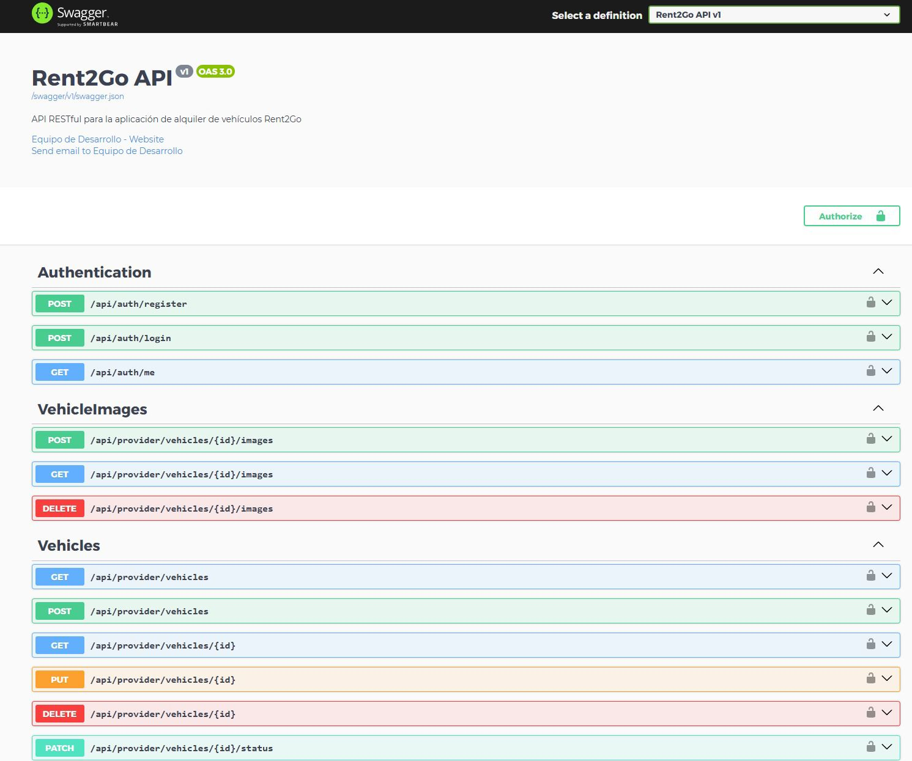
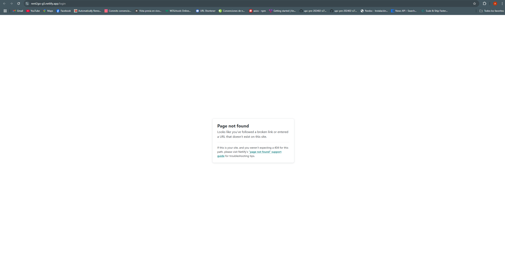
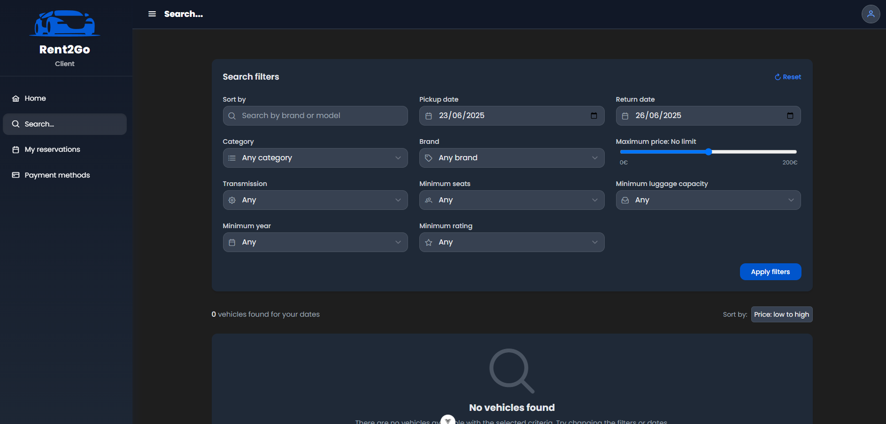
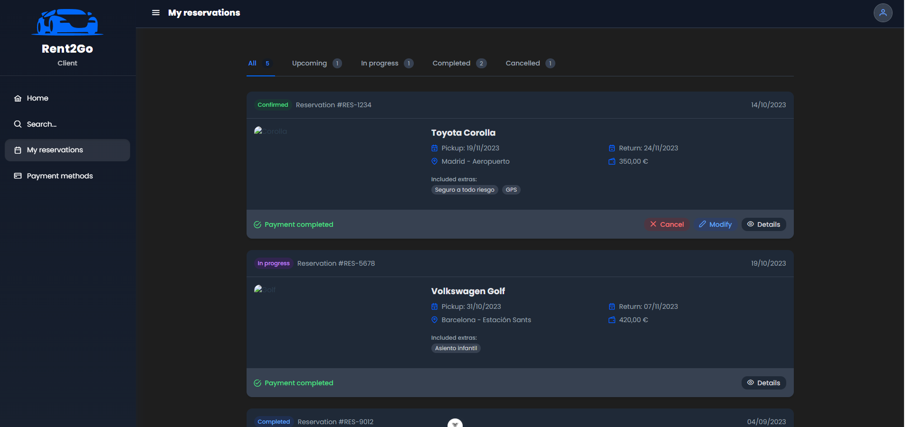

<<<<<<< HEAD
<<<<<<< HEAD
<<<<<<< HEAD
# Capitulo I: Introduccion

---

## 1.1. StartUp Profile

A continuación, vamos a describir de manera detallada nuestra idea de startup. En ella se incluirá la misión y visión de la empresa, así como los perfiles de los integrantes del equipo.

### 1.1.1. Description de la StartUp

Esta empresa ha desarrollado una plataforma digital que funciona como intermediario entre propietarios de vehículos y posibles arrendatarios. La plataforma integra vehículos bajo nuestro nombre, actuando como una flota virtual, pero sin la necesidad de una inversión inicial en vehículos. Nuestro modelo de negocio se basa en conectar a propietarios con arrendatarios interesados, ofreciendo precios competitivos y beneficios para ambas partes. Los propietarios reciben una remuneración únicamente cuando su vehículo es alquilado, lo que garantiza un enfoque eficiente y rentable.

### Misión:
Nuestra misión es facilitar el acceso a vehículos de alquiler de alta calidad, conectando a propietarios y arrendatarios de manera segura y eficiente. Nos esforzamos por ofrecer un servicio que maximice el valor para ambas partes, proporcionando una plataforma confiable y accesible para todos nuestros usuarios.

### Visión:
Convertirnos en la plataforma líder en el mercado de alquiler de vehículos en Perú, reconocidos por nuestra innovación y eficiencia en conectar a propietarios y arrendatarios. Queremos ser la referencia principal para aquellos que buscan alquilar un vehículo sin complicaciones, ofreciendo un servicio integral y de alta calidad.

### 1.1.2. Perfiles de integrantes del equipo

| Integrantes                                                                                                | Descripción                                                                                                                                      | Conocimientos                                                                                                                                                               |
|:-----------------------------------------------------------------------------------------------------------|:-------------------------------------------------------------------------------------------------------------------------------------------------|:----------------------------------------------------------------------------------------------------------------------------------------------------------------------------|
|  <br>Ario Joel Chavez Uribe u202213468            | Soy estudiante de la carrera de Ingeniería de Software. Tengo interés en aprender sobre nuevas tecnologías, el desarrollo web y de aplicaciones. | Poseo conocimientos en los lenguajes de programación: C++, Python, y Javacript. Útiles para el desarrollo y solución del proyecto.                                          |
|  <br>Yair Christofer Aru Acevedo u202125984        | Soy estudiante de la carrera de Ingeniería de Software. Tengo interés en el área de ciberseguridad y en las bases de datos. | Tengo conocimientos en los lenguajes de programación: Javascript, Typescript, C++, C#, Python. Además de conocimiento en las bases de datos relacionales y no relacionales. |
|  <br>Carlos Alberto Gonzalez Custodio u202020230   | Soy estudiante de la carrera de Ingeniería de Software. Me encanta enriquecer mis conocimientos con nuevos desafios y tengo un gran interes por el desarrollo web. | Poseo conocimientos en los lenguajes de programación: C++, Python, Javacript, PHP y C#. Y de algunas bases de datos como MySQL, SQL Server y MongoDB|
|  <br>Carlos Alvarez Ponce 201919386            | Soy estudiante de Ingeniería de Software en la Universidad Peruana de Ciencias Aplicadas (UPC). TMe considero una persona comprometida, organizada y con una gran capacidad para adaptarme a nuevos retos. Me apasiona crear soluciones tecnológicas innovadoras, y en cada proyecto busco aportar lo mejor de mí para resolver los problemas de forma efectiva y eficiente. | Tengo experiencia en desarrollo de software y programación en lenguajes como JavaScript, C++, Python y tecnologías modernas como Next.js y React.|                           |
|  <br>Fernando Jose Salhuana Lopez u201622757            | Soy estudiante de la carrera de Ingeniería de Software, tengo habilidades blandas para que mis compañeros puedan confiar en mí. Soy participativo, resuelvo problemas complicados con facilidad y creativo en todo aspecto. | En formación poseo experiencia en C++, Java, SQL y ciertos conocimientos en programación web.                                           |


## 1.2. Solution Profile

### 1.2.1. Antecedentes y problemática

Para describir nuestra startup de forma ordenada y organizada, emplearemos un técnica que responderá a preguntas básicas del 5W y 2H.

### Antecedentes
- Debido a un aumento significativo en la demanda de soluciones en cuanto a la movilidad temporal y flexible, existe la necesidad de una plataforma que simplifique las comunicaciones entre los dueños y los arrendatarios para el alquiler de vehículos mediante un aplicativo.
### Problemática
- El problema principal radica en la falta de plataformas que faciliten el alquiler de vehículos de manera directa entre propietarios y arrendatarios ha creado una barrera para aquellos que requieran dun automóvil de manera rápida y temporal. Lo que limita a los arrendatarios y perjudica a los propietarios al no poder rentabilizar sus vehículos

#### Técnica de las 5 'W's y 2' H's
## Tabla de análisis 5W2H - Plataforma de alquiler de vehículos entre pares

| Categoría         | Preguntas y Respuestas |
|-------------------|------------------------|
| **¿Qué?**         | **¿Cuál es el problema?**<br>Falta de plataformas que conecten directamente a propietarios de vehículos con arrendatarios, dificultando el acceso a opciones accesibles y confiables de alquiler.<br><br>**¿Cuál es la relación con los usuarios?**<br>Los propietarios no cuentan con medios eficientes para ofrecer sus vehículos, mientras que los arrendatarios tienen problemas para encontrar alternativas viables y confiables. |
| **¿Cuándo?**      | **¿Cuándo ocurre el problema?**<br>Cuando los propietarios desean alquilar sus vehículos, pero no tienen un canal adecuado para hacerlo, y los arrendatarios requieren movilidad temporal sin opciones accesibles.<br><br>**¿Cuándo usan el producto?**<br>Cuando los propietarios listan sus vehículos en la plataforma y los arrendatarios realizan búsquedas y reservas según sus necesidades, como viajes, emergencias o desplazamientos puntuales. |
| **¿Dónde?**       | **¿Dónde usan el producto?**<br>Desde cualquier lugar con acceso a internet: hogar, trabajo o en movimiento.<br><br>**¿A dónde se dirige la solución?**<br>A propietarios que desean monetizar sus vehículos y a arrendatarios que buscan soluciones seguras y flexibles.<br><br>**¿Dónde surge el problema?**<br>Principalmente en zonas urbanas, donde la demanda de movilidad es alta y la oferta de plataformas es limitada. |
| **¿Quiénes?**     | **¿Quiénes están involucrados?**<br>Propietarios de vehículos y arrendatarios que buscan alquilar de forma sencilla y rápida.<br><br>**¿A quiénes afecta el problema?**<br>A los propietarios que no logran rentabilizar sus vehículos y a los arrendatarios que enfrentan dificultades para alquilar de forma inmediata y confiable.<br><br>**¿Quién usará la plataforma?**<br>Ambos grupos: propietarios que desean generar ingresos y arrendatarios con necesidades temporales de transporte. |
| **¿Por qué?**     | **¿Cuál es la causa del problema?**<br>La ausencia de una plataforma que facilite una conexión eficiente y segura entre propietarios y arrendatarios, limitando la disponibilidad de opciones para ambas partes. |
| **¿Cómo?**        | **¿En qué condiciones se utiliza?**<br>Los propietarios acceden cuando desean obtener ingresos mediante el alquiler; los arrendatarios la usan cuando requieren un vehículo temporalmente.<br><br>**¿Cómo conocieron la plataforma?**<br>A través de redes sociales, recomendaciones de usuarios y campañas de marketing enfocadas en movilidad.<br><br>**¿Qué motivó al usuario a buscar esta solución?**<br>La necesidad de una alternativa confiable, accesible y directa para el alquiler de vehículos. |
| **¿Cuánto cuesta?** | **Costos para propietarios:**<br>No hay costos iniciales; solo se aplica una comisión por alquiler concretado.<br><br>**Costos para arrendatarios:**<br>Precios variables según el vehículo y la duración, generalmente más económicos y flexibles que las opciones tradicionales. |


### 1.2.2. Lean UX Process

#### 1.2.2.1. Lean UX Problem Statements

A partir del análisis del contexto y la investigación realizada, se identificaron los siguientes Problem Statements que dan forma a la propuesta de valor de **Rent2Go**, una plataforma peer-to-peer de alquiler de vehículos:

- **Problem Statement 1: Falta de acceso a opciones de alquiler accesibles y confiables**
    - **¿Qué sucede?** Arrendatarios en zonas urbanas del Perú no encuentran vehículos económicos y seguros para alquilar temporalmente.
    - **¿Por qué es un problema?** Las empresas tradicionales imponen precios elevados y requisitos rígidos.
    - **¿A quién afecta?** A personas que requieren movilidad flexible sin comprometerse a una compra.
    - **Solución propuesta:** Una plataforma digital que conecte directamente a arrendatarios con vehículos disponibles de propietarios particulares, eliminando intermediarios y reduciendo costos.

- **Problem Statement 2: Dificultad para monetizar vehículos no utilizados por parte de los propietarios**
    - **¿Qué sucede?** Propietarios de autos que usan poco sus vehículos no tienen medios simples y seguros para alquilarlos.
    - **¿Por qué es un problema?** Se desperdicia un activo valioso que podría generar ingresos pasivos.
    - **¿A quién afecta?** A propietarios con vehículos inactivos o de bajo uso.
    - **Solución propuesta:** Implementar una plataforma donde los propietarios puedan listar fácilmente sus vehículos, controlar condiciones de uso y recibir pagos automáticos.

- **Problem Statement 3: Modelos de negocio costosos y poco escalables**
    - **¿Qué sucede?** El modelo tradicional de alquiler exige tener flota propia, lo cual eleva los costos operativos.
    - **¿Por qué es un problema?** Dificulta escalar y reduce el margen de ganancias.
    - **¿A quién afecta?** A nuevas empresas que buscan entrar al mercado de movilidad sin grandes inversiones.
    - **Solución propuesta:** Desarrollar una solución peer-to-peer donde la plataforma actúe como intermediario tecnológico y no requiera vehículos propios.

- **Problem Statement 4: Falta de confianza y seguridad en plataformas similares**
    - **¿Qué sucede?** Los usuarios temen fraudes, daños a los vehículos o problemas legales.
    - **¿Por qué es un problema?** Reduce la adopción del servicio y frena el crecimiento.
    - **¿A quién afecta?** Tanto a propietarios como a arrendatarios.
    - **Solución propuesta:** Incorporar verificación de identidad, contratos digitales, seguros, políticas claras y soporte 24/7 para garantizar una experiencia segura.

- **Problem Statement 5: Crecimiento limitado por falta de validación social**
    - **¿Qué sucede?** Los usuarios nuevos se basan en recomendaciones y experiencias previas para tomar decisiones.
    - **¿Por qué es un problema?** Sin confianza, no hay expansión.
    - **¿A quién afecta?** A toda la comunidad de la plataforma.
    - **Solución propuesta:** Activar mecanismos de calificación, comentarios, referidos y recompensas que fortalezcan la reputación colectiva.

Rent2Go se propone como una solución innovadora, accesible y escalable dentro del sector del alquiler de vehículos, ofreciendo beneficios económicos tanto a propietarios como a arrendatarios, y resolviendo las limitaciones del modelo tradicional.


#### 1.2.2.2. Lean UX Assumptions

**Business Assumptions:**

- **Creemos que nuestros clientes tienen la necesidad de:**
  Monetizar sus vehículos sin encargarse de la gestión operativa, y acceder a opciones de alquiler accesibles y flexibles sin los compromisos de la propiedad.

- **Estas necesidades se pueden satisfacer con:**
  Una plataforma peer-to-peer que conecte directamente a propietarios de vehículos con personas que desean alquilarlos, automatizando procesos como pagos, seguros, reservas y verificaciones de usuarios.

- **Nuestros clientes iniciales son (o serán):**
  Propietarios de vehículos particulares con baja frecuencia de uso, interesados en generar ingresos pasivos, y arrendatarios que buscan soluciones económicas, prácticas y rápidas para alquilar vehículos por períodos cortos o medios.

- **El valor principal que un cliente quiere obtener de nuestro servicio es:**
  Generar ingresos de manera sencilla (para propietarios) y acceder a una solución de movilidad accesible y sin complicaciones (para arrendatarios).

- **Los clientes también pueden obtener estos beneficios adicionales:**
  Mayor control sobre su experiencia (precio, horarios, condiciones), disponibilidad de una variedad de vehículos y una experiencia más personalizada frente a las opciones tradicionales.

- **Adquiriremos a la mayoría de nuestros clientes a través de:**
  Campañas digitales, estrategias de referidos, marketing de contenido, y alianzas con comunidades urbanas, de viajeros o emprendedores.

- **Ganaremos dinero mediante:**
  Comisiones por cada transacción realizada en la plataforma, así como mediante servicios premium opcionales como seguros ampliados, visibilidad destacada de vehículos, y tarifas dinámicas inteligentes.

- **Nuestra competencia principal en el mercado será:**
  Empresas tradicionales de alquiler de autos, otras plataformas P2P con modelos similares, y servicios de movilidad como carsharing.

- **Les superaremos debido a:**
  Nuestro modelo sin flota propia, nuestra eficiencia operativa, la experiencia del usuario centrada en la simplicidad y accesibilidad, y un sistema de incentivos para ambos segmentos.

- **El mayor riesgo para nuestro producto es:**
  No generar suficiente confianza inicial entre usuarios (tanto propietarios como arrendatarios), especialmente en lo que respecta a la seguridad, el estado del vehículo y el cumplimiento de los términos acordados.

**User Assumptions:**

- **¿Quién es el usuario?**
  Propietarios de vehículos que desean generar ingresos pasivos, y arrendatarios que buscan soluciones de movilidad más económicas, cómodas y accesibles que las opciones tradicionales.

- **¿Dónde encaja nuestro producto en su trabajo o vida?**
  En la rutina diaria de los propietarios como una fuente secundaria de ingresos, y en la vida de los arrendatarios como una solución a necesidades puntuales o recurrentes de transporte.

- **¿Qué problemas resuelve nuestro producto?**
  El desaprovechamiento económico de vehículos poco usados, y la falta de opciones accesibles y flexibles para quienes necesitan alquilar un vehículo de forma ocasional o temporal.

- **¿Cuándo y cómo se utiliza nuestro producto?**
  Los propietarios ingresan a la plataforma para registrar y gestionar su vehículo, establecer disponibilidad y monitorear ingresos. Los arrendatarios usan la plataforma cuando necesitan un auto para ocasiones específicas como viajes, mudanzas, o necesidades diarias.

- **¿Qué características son importantes?**
  Seguridad, verificación de usuarios, facilidad de uso, disponibilidad variada de vehículos, opciones de filtrado y búsqueda eficiente, automatización de pagos y seguros.

- **¿Cómo debería verse y comportarse nuestro producto?**
  Debería ser visualmente atractivo, intuitivo, confiable y ofrecer una experiencia fluida en todos los dispositivos. Debe inspirar confianza desde el primer contacto y facilitar todo el proceso sin fricciones.

- **El valor principal que un usuario quiere obtener de nuestra funcionalidad es:**
  Confianza, control, comodidad y rentabilidad.

- **Los usuarios también pueden obtener estos beneficios adicionales:**
  Recompensas por fidelidad o referidos, retroalimentación transparente, y un sentido de comunidad colaborativa.

- **El mayor riesgo para el usuario es:**
  Que la experiencia no cumpla con sus expectativas en términos de seguridad, eficiencia o rentabilidad, generando desconfianza o abandono de la plataforma.

**User Outcomes:**

- **Monetización Pasiva Efectiva:** Los propietarios de vehículos lograrán generar ingresos de manera sencilla, sin involucrarse directamente en procesos logísticos o administrativos, lo cual les proporcionará una nueva fuente de ingresos sin comprometer su tiempo.

- **Movilidad Accesible y Flexible:** Los arrendatarios podrán acceder a vehículos en su zona con precios más bajos y condiciones personalizadas, lo que les permitirá satisfacer sus necesidades de transporte sin necesidad de adquirir un vehículo propio.

- **Confianza y Seguridad en la Comunidad:** La plataforma fomentará un entorno seguro para ambas partes, gracias a verificaciones, evaluaciones, pólizas de seguro y soporte activo, facilitando relaciones de confianza entre usuarios.

**Business Outcomes:**

- **Crecimiento Orgánico y Participativo:** Se espera que el 20% de los propietarios iniciales recomienden la plataforma a otros dentro de los primeros tres meses, generando un efecto de red positivo que amplíe la oferta de vehículos.

- **Conversión Sostenible de Usuarios:** Esperamos que al menos el 30% de los arrendatarios que realicen un primer alquiler regresen a usar la plataforma dentro de los siguientes 60 días, consolidando una base activa de usuarios frecuentes.

- **Reducción de Costos Operativos por Modelo P2P:** Al no requerir inversión en flota propia, se proyecta que los costos operativos sean al menos 50% menores respecto a modelos tradicionales, permitiendo márgenes más competitivos desde el inicio.

**Feature Assumptions:**

- **Gestión Autónoma de Vehículos para Propietarios:**
  - Panel para listar vehículos, establecer precios y disponibilidad.
  - Sistema automatizado de pagos y estadísticas de ingresos.

- **Proceso de Alquiler Simplificado para Arrendatarios:**
  - Búsqueda rápida por zona, tipo de vehículo, precio y disponibilidad.
  - Reserva inmediata con confirmación, verificación de identidad y opciones de seguro.

- **Sistema de Evaluación y Confianza Bidireccional:**
  - Calificaciones y comentarios para arrendatarios y propietarios.
  - Historial de transacciones y comportamiento.

- **Soporte y Seguridad Integrados:**
  - Integración con seguros para cobertura durante los alquileres.
  - Centro de ayuda automatizado y atención al cliente 24/7.

- **Programa de Referidos y Fidelización:**
  - Incentivos por invitar a nuevos usuarios y por uso recurrente.
  - Recompensas por buenos comportamientos y altas calificaciones.

#### 1.2.2.3. Lean UX Hypothesis Statements

1. **Creemos que lograremos** atraer a propietarios de vehículos interesados en generar ingresos pasivos **si** ofrecemos una plataforma que les permita listar sus vehículos de manera sencilla, con procesos claros y garantías de seguridad.  
   **Al proporcionar** un sistema confiable que minimice su involucramiento operativo y ofrezca visibilidad de ingresos, **con la implementación** de herramientas de monitoreo, seguros integrados y asistencia al cliente, facilitaremos la decisión de participación y retención en la plataforma.

2. **Creemos que lograremos** aumentar la preferencia y uso por parte de los arrendatarios **si** la plataforma ofrece una experiencia de alquiler fácil, rápida y económica, con altos estándares de seguridad y confianza.  
   **Al enfocarnos** en una interfaz amigable, opciones de búsqueda personalizadas y procesos de reserva eficientes, **con la incorporación** de valoraciones, verificaciones de identidad y soporte durante todo el proceso, podremos fidelizar a los usuarios y mejorar la percepción del servicio.

3. **Creemos que lograremos** una ventaja competitiva sostenible y un crecimiento escalable **si** mantenemos un modelo de negocio sin inversión directa en la adquisición de vehículos.  
   **Al eliminar** los costos operativos relacionados con la gestión de flota propia, **con la reinversión** en áreas como tecnología, marketing dirigido y soporte al cliente, podremos mantener precios competitivos y ofrecer una propuesta de valor sólida tanto para propietarios como para arrendatarios.


#### 1.2.2.4. Lean UX Canvas


# 1.3. Segmentos Objetivo

### Segmento Objetivo #1: Propietarios de Vehículos

**Aspectos demográficos:**
- Sexo: Masculino y femenino
- Edad: Entre 18 y 60 años
- Nivel socioeconómico: Clases A, B y C (alta, media alta y media)

**Aspectos geográficos:**
- Nacionalidad: Peruana
- Residencia: Zonas urbanas a nivel nacional

**Aspectos psicográficos:**
- Personas naturales o jurídicas que poseen vehículos que no utilizan con frecuencia.
- Interesados en generar ingresos pasivos sin invertir demasiado tiempo o esfuerzo.
- Buscan una solución segura, rápida y confiable para alquilar sus vehículos de manera ocasional o constante.

---

### Segmento Objetivo #2: Arrendatarios de Vehículos

**Aspectos demográficos:**
- Sexo: Masculino y femenino
- Edad: Entre 18 y 50 años
- Nivel socioeconómico: Clases A, B y C (alta, media alta y media)

**Aspectos geográficos:**
- Nacionalidad: Peruana
- Residencia: Zonas urbanas a nivel nacional

**Aspectos psicográficos:**
- Personas que utilizan transporte público pero desean evitar la incomodidad y pérdida de tiempo en el tráfico diario.
- Usuarios que no cuentan con un vehículo propio, pero requieren uno temporalmente para trabajo, viajes o actividades puntuales.
- Interesados en una alternativa accesible, flexible y confiable para el alquiler de vehículos por cortos periodos.

---

Estos dos segmentos representan tanto la **oferta** como la **demanda** de la plataforma, siendo fundamentales para su crecimiento y sostenibilidad en diversas ciudades del país.

# Capítulo II: Requirements Elicitation & Analysis

En este capítulo se realizará el proceso de Análisis competitivo y Needfinding necesario para la identificación de las necesidades de nuestro segmento objetivo.

## 2.1. Competidores

A continuacion realizaremos un análisis de los productos de software ofrecidos por la competencia en el mercado de nuestra solución y las técnicas que emplearíamos para destacar.

### 2.1.1. Análisis Competitivo

A continuación se presenta un análisis competitivo de las empresas que ofrecen servicios similares a Rent2Go.

<table>
  <tr>
    <th colspan="6"><b>Competitive Analysis Landscape</b></th>
  </tr>
  <tr>
    <td>¿Por qué llevar a cabo este análisis?</td>
    <td  colspan="5">Este análisis fue realizado con el propósito de estudiar el valor ofrecido por las empresas que compiten con nuestra solucion. La informacion obtenida nos proporcionará la perspectiva necesaria para la realizacion de un servicio innovador.
    </td>
  </tr>
  
  <tr>
    <td colspan="2"></td>
    <td ><b>Rent2Go</b></td>
    <td ><b>Rento</b></td>
    <td ><p><b>Hertz</b></p></td>
    <td ><p><b>Avis</b></p></td>
  </tr>
  
  <tr>
    <td rowspan="2">
      <b>Perfil</b>
    </td>
    <td >
      <b>Overview</b>
    </td>
    <td >
      <p>Plataforma web y aplicación móvil para gestión de alquileres P2P, pagos y monitoreo de vehículos.
    </td>
    <td >
      <p>Plataforma web y aplicación móvil que facilita el alquiler de vehículos de particulares
    </td>
    <td >
      <p>Plataforma web y aplicación móvil que facilita el alquiler de vehículos tanto en aeropuertos como en ciudades.
    </td>
    <td >
      <p>Aplicacion de reservas de autos en línea
    </td>
  </tr>
  
  <tr>
    <td >
      <b>Ventaja competitiva ¿Qué valor ofrece a los clientes?</b>
    </td>
    <td >
      <p>Flexibilidad en precios y disponibilidad, y generación de ingresos para los propietarios sin necesidad de inversión en flota.
    </td>
    <td >
      <p>Modelo peer-to-peer que permite a los propietarios generar ingresos pasivos con su vehículo. Seguridad para ambas partes a través de seguros todo riesgo y monitoreo GPS.
    </td>
    <td >
      <p>Red global de ubicaciones, servicio confiable y una amplia variedad de vehículos. Reputación consolidada y un fuerte programa de fidelización.
    </td>
    <td >
      <p>Enfoque en el servicio al cliente de alta calidad, con una variedad de opciones de vehículos y soluciones tanto para clientes particulares como corporativos.
    </td>
  </tr>
  
  <tr>
    <td rowspan="2" >
      <b>Perfil de Marketing</b>
    </td>
    <td >
      <b>Mercado objetivo</b>
    </td>
    <td >
      <p>Propietarios de vehículos que desean alquilarlos cuando no los usan.
      <p>Arrendatarios que buscan opciones más económicas y flexibles que las ofrecidas por las grandes empresas de alquiler.
    </td>
    <td >
      <p>Propietarios de vehículos que buscan generar ingresos cuando no usan sus autos.
      <p>Arrendatarios que buscan opciones más económicas y flexibles que las ofrecidas por las grandes empresas de alquiler.
    </td>
    <td >
      <p>Turistas internacionales y locales.<p>Ejecutivos y viajeros de negocios.
      <p>Clientes que necesitan autos por períodos cortos o largos.
    </td>
    <td >
      <p>Turistas y viajeros de negocios.
      <p>Empresas que buscan alquileres a largo plazo o soluciones corporativas.
    </td>
  </tr>
  
  <tr>
    <td >
      <b>Estrategias de marketing</b>
    </td>
    <td >
      <p>Publicidad en redes sociales.
      <p>Promociones con descuentos en los primeros alquileres.
      <p>Alianzas estratégicas con aseguradoras para ofrecer seguridad y confianza.
    </td>
    <td >
      <p>-Publicidad digital en redes sociales y campañas de concientización sobre la economía colaborativa.
      <p>Alianzas con aseguradoras para ofrecer seguros integrados.
    </td>
    <td >
      <p>Publicidad en aeropuertos, marketing digital, y promociones a través de programas de fidelización.
      <p>Presencia en ferias y eventos de turismo.
      <p>Alianzas con aerolíneas y agencias de viajes.
    </td>
    <td >
      <p>Marketing dirigido a clientes corporativos y viajeros frecuentes.
      <p>Promociones digitales y descuentos a través de alianzas con aerolíneas y hoteles.
      <p>Programas de fidelizacion
    </td>
  </tr>
  
  <tr>
    <td rowspan="3" >
      <b>Perfil de Producto</b>
    </td>
    <td >
      <b>Productos y Servicios</b>
    </td>
    <td >
      <p>Alquiler de vehículos particulares.
      <p>Seguro y monitoreo GPS integrados.
      <p>Opciones de alquiler a corto y mediano plazo.
    </td>
    <td >
      <p>Alquiler de vehículos particulares a corto y mediano plazo.
      <p>Seguro todo riesgo y monitoreo en tiempo real.
      <p>Opciones de reserva directa y pagos a través de la app.
    </td>
    <td >
      <p>Alquiler de autos estándar, SUV, autos de lujo, y vehículos comerciales.
      <p>Seguros, GPS, y recogida/entrega en ubicaciones seleccionadas.
    </td>
    <td >
      <p>Autos económicos, SUV, vehículos de lujo, y comerciales.
      <p>Alquileres a largo plazo para clientes corporativos.
    </td>
  </tr>
  
  <tr>
    <td >
      <b>Precios y Costos</b>
    </td>
    <td >
      <p>Precios más bajos que las compañías tradicionales de alquiler debido a la ausencia de una flota física. 
      <p>Bajos costos operativos gracias al modelo P2P. 
    </td>
    <td >
      <p>Precios dinámicos y más bajos que los de las empresas tradicionales de alquiler.
      <p>Bajos costos operativos debido a la ausencia de una flota física.
    </td>
    <td >
      <p>Tarifas diarias o semanales, generalmente más altas que servicios P2P debido a la infraestructura y la cobertura global.
      <p>Descuentos para clientes recurrentes y programas de fidelización.
    </td>
    <td >
      <p>Precios premium, con descuentos para empresas y clientes recurrentes.
      <p>Altos costos operativos debido a la amplia infraestructura y mantenimiento de vehículos.
    </td>
  </tr>
  
  <tr>
    <td >
      <b>Canales de distribución (Web y/o móvil)</b>
    </td>
    <td >
      <p>Plataforma web y aplicación móvil.
      <p>Colaboraciones con aseguradoras y promociones digitales.
    </td>
    <td >
      <p>Plataforma web y aplicación móvil.
      <p>Asociaciones con aseguradoras y redes sociales.
    </td>
    <td >
      <p>Plataforma web, aplicación móvil, y oficinas físicas en aeropuertos y ciudades.
    </td>
    <td >
      <p>Plataforma web, aplicación móvil, y oficinas físicas en aeropuertos y centros comerciales.
    </td>
  </tr>
  
  <tr>
    <td rowspan="5" >
      <p><b>Análisis SWOT</b>
    </td>
    <td colspan="5" >
      <p>Realice esto para su startup y sus competidores. Sus fortalezas deberían apoyar sus oportunidades y contribuir a lo que ustedes definen como su posible ventaja competitiva.
    </td>
  </tr>
  <tr>
    <td ><b>Fortalezas</b></td>
    <td >
      <p>Modelo flexible y económico, bajos costos operativos, facilidad de uso.
    </td>
    <td >
      <p>Modelo flexible y seguro, costos operativos bajos.
    </td>
    <td>
      <p>Marca consolidada, presencia global, variedad de vehículos.
    </td>
    <td>
      <p>Reputación sólida, servicio de alta calidad, fuerte presencia en el mercado corporativo.
    </td>
  </tr>
  <tr>
    <td ><b>Debilidades</b></td>
    <td >
      <p>Menor infraestructura y recursos comparados con las empresas tradicionales.
    </td>
    <td >
      <p>Dependencia de la confianza en la plataforma y en los seguros.
    </td>
    <td>
      <p>Altos costos comparados con opciones P2P.
    </td>
    <td>
      <p>Precios más altos, lo que puede limitar a ciertos segmentos del mercado.
    </td>
  </tr>
  <tr>
    <td ><b>Oportunidades</b></td>
    <td >
      <p>Rápida adopción de soluciones de movilidad compartida, especialmente en mercados emergentes.
    </td>
    <td >
      <p>Crecimiento del mercado de la economía colaborativa.
    </td>
    <td>
      <p>Expansión en mercados emergentes y adopción de nuevas tecnologías para la gestión de flotas.
    </td>
    <td>
      <p>Crecimiento en servicios corporativos y soluciones de movilidad a largo plazo.
    </td>
  </tr>
  <tr>
    <td ><b>Amenazas</b></td>
    <td >
      <p>Regulaciones locales y competencia de otras plataformas P2P establecidas.
    </td>
    <td >
      <p>Regulaciones gubernamentales y competencia emergente en el sector P2P.
    </td>
    <td>
      <p>Creciente competencia de plataformas digitales P2P y modelos de movilidad compartida.
    </td>
    <td>
      <p>Competencia de plataformas P2P y otros modelos de alquiler más flexibles.
    </td>
  </tr>
</table>

### 2.1.2. Estrategias y tácticas frente a competidores

A continuación se muestran las tácticas que deberá aplicar nuestra startup para afrontar las fortalezas de la competencia.

Táctica: Mientras las grandes compañías cuentan con sistemas sofisticados, Rent2Go puede enfocarse en mejorar la usabilidad y simplicidad de su plataforma digital, ofreciendo un proceso de alquiler más ágil. Se debe invertir en el desarrollo de una aplicación intuitiva y fácil de usar, con un proceso de reserva fluido. Agregar funcionalidades como la reserva en pocos clics y recomendaciones personalizadas basadas en el historial de alquileres.

Táctica: Fomentar reseñas y recomendaciones dentro de la plataforma. La confianza es clave en el modelo P2P. Se debe crear un entorno seguro y confiable para todos los usuarios.

## 2.2. Entrevistas

En esta sección se elaborará una investigación con base en entrevistas a representantes del segmento objetivo.

### 2.2.1. Diseño de entrevistas

A continuación se presentan las preguntas diseñadas para las entrevistas a los segmentos objetivo.

Con el objetivo de comprender la necesidad y la demanda en nuestro sector por parte de nuestro publico objetivo. Por ello, elaboramos las siguientes preguntas con el fin de recolectar información cualitativa y/o cuantitativa, la cual se verá divida por nuestros segmentos objetivos.

**Preguntas Generales**

- ¿Cuál es su nombre?
- ¿Cuántos años tiene usted?
- ¿En que ciudad y distrito reside?
- ¿A qué se dedica o cual es su ocupación?

**Preguntas Específicas**

**Segmento 1: Propietarios de vehículos**

- ¿Cuántos vehículos posee usted?
- ¿Con que frecuencia se transporta de su(s) vehículos(s)?
- ¿Cuándo no utiliza su vehículo, donde permanece el mismo?
- ¿Ha usted alquilado su vehículo anteriormente? Si la respuesta es: <br>
 Si: ¿Qué dificultades presento alquilarlo? <br>
 No: ¿Cuan dispuesto se encuentra usted a alquilar su vehículo?
- ¿Conoce alguna plataforma para el alquiler de vehículos en su entorno?
- ¿Qué tipo de garantías y compensación esperarías sobre alquilar tu vehículo?
- ¿Considera una opción llamativa el no tener que preocuparse por su vehículo y además, recibir ingresos por ello?

**Segmento 2: Usuarios arrendatarios**

- ¿Con que frecuencia te transportas en el día a día?
- ¿Cuánto dinero crees que gastas en movilizarte cada semana?
- ¿Si tuvieras un auto, cuál sería el principal uso que le darías?
- ¿Alguna vez pensaste en alquilar un auto? Si la respuesta es: <br> Si: ¿Nos podrías contar acerca de tu experiencia y tu opinión? <br> No: ¿Cuáles son los motivos por los que no opto por alquilar un vehículo?
- ¿Qué aspectos negativos encuentra al alquilar un vehículo para uso propio?
- ¿Conoce alguna plataforma de confianza donde puede hallar el vehículo adecuado a su necesidad?

**Preguntas sobre la idea del proyecto**

- ¿Qué opina acerca de Rent2Go, una plataforma donde podrás alquilar y confiar tu vehículo de forma segura y confiable?
- ¿Qué aspecto le llama más la atención?
- ¿Nos podría brindan alguna recomendación para mejorar la idea de la plataforma?
- ¿Recomendaría el uso de nuestra aplicación a sus conocidos?

### 2.2.2. Registro de entrevistas

A continuación se presenta el registro de las entrevistas realizadas a los segmentos objetivo.

<b> Segmento Objetivo 1: </b> Propietarios de vehículos

<b> Entrevista 1 </b> 

- Nombre: Cesar
- Apellidos: Sulca 
- Edad: 33
- Distrito: Pueblo Libre
- Link de la entrevista: <a href="[link](https://drive.google.com/file/d/1lhF1MRvqO_znf4bpAuquj9yN6EvKG8Hy/view)">Entrevista</a>
- Duración: 1:06 minutos
- Inicio de la entrevista: 0:01 

Evidencia de la reunión:

<div align="center">
    
</div>

Resumen de la entrevista:

-La persona entrevistada expresa que tiene dos vehículos.
-Solo usa los fines de semana por lo cual de lunes a viernes están sin uso.
-Indica que nunca habia escuchado de aplicaciones sobre alquiler de autos.
-Desconfía en primera impresión porque no sabe las medidas seguridad que ofrecen.

<b> Entrevista 2 </b> 

- Nombre: Joel
- Apellidos: Chavez
- Edad: 41 años
- Distrito: Huaraz
- Link de la entrevista: <a href="link">Entrevista</a>
- Duración: 4:00 minutos
- Inicio de la entrevista: 0:00 

Evidencia de la reunión:

<div align="center">
    
</div>


Resumen de la entrevista:

- Utiliza frecuentemente su vehículo para movilizarse al trabajo.
- Ha alquilado su vehículo anteriormente y menciona que el problema es hacerles un adecuado seguimiento a los vehículos para su respectivo mantenimiento.
- También se menciona respecto al cuidado de los vehículos, no tener que preocuparse por los posibles daños y recibir ganancias de manera óptima.
- Le resulta interesante la propuesta ya que le permite un mayor control sobre su alquiler además de lo amigable que puede ser nuestra plataforma.
- Le gustaría que la plataforma se encuentre disponible todo el tiempo para acceder a las funcionalidades de nuestra aplicación.


<b> Entrevista 3 </b> 

- Nombre:
- Apellidos:
- Edad:
- Distrito:
- Link de la entrevista: <a href="link">Entrevista</a>
- Duración:
- Inicio de la entrevista:

Evidencia de la reunión:

<div align="center">
    
</div>


Resumen de la entrevista:

-
<br>

<b> Segmento Objetivo 2: </b> Usuarios arrendatarios

<b> Entrevista 4 </b> 

- Nombre: Esaut
- Apellidos: Salhuana
- Edad: 26
- Distrito: Ate
- Link de la entrevista: <a href="link">Entrevista</a> 
- Duración: 2:11
- Inicio de la entrevista: 0:01

Evidencia de la reunión:

<div align="center">
    
</div>

Resumen de la entrevista:

-La persona entrevista comenta que su casa tiene un espacion amplio para estacionar, de cual seria una gran oportunidad para generar ingresos. Además, menciona que es muy importante el tema de la seguridad de la aplicación ya que a pesar de eso, él tiene su propio sistema de seguridad. También, asegura que nunca escuchó o se enteró sobre alguna aplicación similar.

<br>

<b> Entrevista 5 </b> 

- Nombre: 
- Apellidos: 
- Edad: 
- Distrito: 
- Link de la entrevista: <a href="">Entrevista</a>
- Duración: x:xx minutos
- Inicio de la entrevista: 0:00

Evidencia de la reunión:

<div align="center">
    
</div>


Resumen de la entrevista:

- 
- 
- 
- 
- 
- 


<br>

<b> Entrevista 6 </b> 

- Nombre: Karla
- Apellidos: Lopez
- Edad: 22
- Distrito: Huaraz
- Link de la entrevista: <a href="">https://shorturl.at/raxVh</a>
- Duración: 3:21 minutos
- Inicio de la entrevista: 0:37

Evidencia de la reunión:

<div align="center">
    
</div>


Resumen de la entrevista:

- En al entrevista se menciona el uso constante del transporte público para movilizarse a su lugar objetivo
- No realizó ningún alquiler en algún otro lado
- No existen aplicaciones que brinden estas características en su zona
- Menciona que la propuesta de la aplicación es buena y la recomendaría
- Menciona que uno de sus temores son los posibles daños relacionados con el vehículo


<br>

### 2.2.3. Análisis de entrevistas

<b>Análisis General - Segmento 1:</b>

Nuestros entrevistados poseedores de vehículos concuerdan en que el ingreso pasivo en base a un activo el cual no es usado de forma diaria en ninguno de los casos es beneficio. De la misma manera todos concuerdan en que no existe una plataforma con la publicidad y la confianza para propietarios como ellos puedan alquilar su vehículo obteniendo beneficios, lo que confirma nuestra teoría de la falta de una plataforma para esta necesidad existente.

Asimismo, existe una preocupación entre nuestros entrevistados el cual es la seguridad, el hecho de que alquilar tu auto sea seguro y bajo esa seguridad, confiar en el funcionar de la plataforma. Lo que significa que debemos de especializarnos en ofrecer un servicio seguro y que inspire confianza en nuestro usuarios proovedores del activo necesario para el funcionamiento de nuestra start-up.

Un dato interesante es que a pesar de las diferencias de edad presente entre los primeros dos entrevistados al tercero, percibimos la misma necesidad o entusiasmo por recibir un ingreso pasivo sin la necesidad de invertir tiempo, lo que nos lleva a pensar que existe un público amplio para nuestro producto.

<b>Análisis General - Segmento 2:</b>

Los usuarios entrevistados suelen tener una edad joven y se entiende que gran parte serán personas jóvenes adultas, ya que normalmente se movilizan mucho y no poseen un bien propio, ya que van en el camino a ello. Por lo que, de la misma forma, captamos una necesidad palpante. 

Cabe resaltar que se menciona que el monto de transporte semanal en los entrevistados es elevado lo que refleja que existe un gasto considerable, de la misma forma, no optan por alquilar un auto debido al costo que este inclute, la falta de opciones y los trámites tediosos. Lo que refuerza nuestra idea de negocio.

Táctica: Incluir características como verificación de identidad, historial de alquileres, seguros integrados y monitoreo de vehículos por GPS.

## 2.3. Needfinding

En esta sección se muestra el proceso de análisis de la información recolectada en las entrevistas. Se incluyen los User Personas, User Task Matrix, User Journey Maps, Empathy Mapping y As-Is Scenario Mapping

### 2.3.1. User Personas

A continuación brindamos las fichas de User Persona elaboradas a partir del análisis de las entrevistas realizadas.


### 2.3.2. User Task Matrix

A continuación se muestra el proceso para la realizacion del User Task Matrix para comprender las tareas que realizan los User Persona para cumplir sus objetivos.

| Tarea                         | María López    | Juan Pérez     |
|-------------------------------|----------------|----------------|
| Explorar opciones de alquiler | Alta - Media   | Baja - Media   |
| Reservar-Alquilar un vehículo | Media - Alta   | Baja - Alta    |
| Gestionar el alquiler         | Baja - Baja    | Baja - Media   |
| Seguridad y monitoreo         | Alta - Alta    | Baja - Alta    |
| Devolución del vehículo       | Baja - Alta    | Baja - Media   |

Tareas con mayor frecuencia e importancia

- Seguridad y monitoreo: Esta tarea es la más importante y frecuentemente realizada tanto para María como para Juan. Para ambos, la seguridad es una prioridad. En el caso de María, busca seguridad principalmente para ella como arrendataria, mientras que Juan se preocupa por el estado de su vehículo cuando es alquilado.

- Reservar/Alquilar un vehículo: La importancia de esta tarea es alta para ambos usuarios, ya que es un punto clave en la experiencia de uso de la plataforma. Sin embargo, para María, esta tarea no es tan frecuente, ya que solo alquila vehículos en ocasiones puntuales. Por su parte, Juan también la considera importante porque es fundamental para generar ingresos.

Principales diferencias

- Explorar opciones de alquiler: María explora opciones de alquiler con mayor frecuencia que Juan, pues ella es arrendataria y necesita encontrar un vehículo que se ajuste a sus necesidades y preferencias, como el costo y la seguridad. Juan, en cambio, es propietario de un vehículo y esta tarea no es tan relevante para él, ya que su enfoque está en alquilar su propio coche.

- Gestionar el alquiler: Para María, la gestión del alquiler es menos importante. Solo necesita asegurarse de que el vehículo que ha alquilado esté disponible y en buen estado. Juan, sin embargo, gestiona más frecuentemente este proceso porque busca mantener control sobre el uso de su vehículo mientras está alquilado, asegurándose de que no se dañe y se cumplan las condiciones acordadas.

Coincidencias

Ambos usuarios comparten una fuerte preocupación por la seguridad y el monitoreo del vehículo, aunque por motivos diferentes. María se enfoca en sentirse segura mientras usa el servicio, mientras que Juan se preocupa por el estado de su vehículo mientras está en manos de un arrendatario. Esto resalta que cualquier plataforma P2P debe priorizar funciones de seguridad para satisfacer tanto a los arrendatarios como a los propietarios.

### 2.3.3. User Journey Mapping

A continuación se muestra el proceso para la realización del User Journey Mapping para los User Persona con el fin de entender las experiencias del usuario sin nuestra solución.

User Journey Mapping para Juan Pérez:

<div align="center">
    
</div>

User Journey Mapping para María López:

<div align="center">
    
</div>

### 2.3.4. Empathy Mapping

A continuación se muestra el proceso para la realización del Empathy Mapping para los User Persona con el fin de entender lo que piensa, siente, oye, hace y observa.

<div align="center">
    
</div>

<div align="center">
    
</div>

### 2.3.5. As-is Scenario Mapping

A continuación se muestra el proceso para la realización del As-Is Scenario Mapping para los User Persona.

<div align="center">
    
</div>

<div align="center">
    
</div>

## 2.4. Ubiquitous Language

En esta sección definiremos los términos y conceptos que utilizaremos en nuestro business domain. Este glosario permitirá la comunicación entre los stakeholders y los miembros del equipo.

- Car (auto)
  Vehículo motorizado utilizado para el transporte.
- Rental (alquiler)
  Contrato en el cual dos partes se obligan de manera recíproca y por un tiempo determinado la cesión de un bien o servicio quedando obligada la parte que aprovecha la posesión a pagar un precio cierto.​
- Peer to Peer
  Plataforma en la que dos personas interactúan directamente entre sí, sin la intermediación de un tercero.

# Capítulo III: Requirements Specification

## 3.1. To-Be Scenario Mapping

A continuación se presenta la realizacion del To-Be Scenario Mapping por cada user persona.

Segmento Objetivo 1: Juan Pérez


<br>

Segmento Objetivo 2: María Lopez


<br>

## 3.2. User Stories

## 3.2. User Stories

| ID    | Nombre                            | Descripción                                                                                       | Criterios de aceptación                                                                                                                                                                                                                                                                                        | Épica     |
|-------|-----------------------------------|----------------------------------------------------------------------------------------------------|------------------------------------------------------------------------------------------------------------------------------------------------------------------------------------------------------------------------------------------------------------------------------------------------------------------|-----------|
| HU01 | Registrar un vehículo          | **Como** propietario, **Quiero** registrar un vehículo en la plataforma **Para** que los arrendatarios puedan alquilarlo.                               | **Escenario 01: Registro exitoso.**<br>**Dado** que el propietario desea registrar un vehículo.<br>**Cuando** ingresa los detalles requeridos (marca, modelo, año, precio, etc.).<br>**Entonces** el sistema guarda el vehículo y lo pone disponible Para ser alquilado.<br><br>**Escenario 02: Fallo en el registro.**<br>**Dado** que el propietario intenta registrar un vehículo.<br>**Cuando** falta información o hay datos incorrectos.<br>**Entonces** el sistema muestra un mensaje de error y no permite completar el registro hasta que se corrijan los datos. | EP01  |
| HU02 | Buscar vehículos disponibles   | **Como** arrendatario, **Quiero** buscar vehículos disponibles en la plataforma **Para** seleccionar el que mejor se ajuste a mis necesidades.           | **Escenario 01: Búsqueda exitosa.**<br>**Dado** que el arrendatario desea buscar un vehículo.<br>**Cuando** ingresa criterios como ubicación, precio y tipo de vehículo.<br>**Entonces** el sistema muestra una lista de vehículos que cumplen con los criterios de búsqueda.<br><br>**Escenario 02: No hay vehículos disponibles.**<br>**Dado** que el arrendatario busca un vehículo.<br>**Cuando** no hay vehículos que cumplan con los criterios de búsqueda.<br>**Entonces** el sistema muestra un mensaje indicando que no hay vehículos disponibles. | EP02  |
| HU03 | Filtrar vehículos por precio   | **Como** arrendatario, **Quiero** filtrar los vehículos por precio **Para** encontrar uno que se ajuste a mi presupuesto.                                | **Escenario 01: Filtro aplicado correctamente.**<br>**Dado** que el arrendatario desea filtrar vehículos por precio.<br>**Cuando** selecciona un rango de precios.<br>**Entonces** el sistema muestra vehículos que estén dentro de ese rango.<br><br>**Escenario 02: No hay vehículos en el rango de precio.**<br>**Dado** que el arrendatario filtra por un rango de precio.<br>**Cuando** no hay vehículos que coincidan con el rango seleccionado.<br>**Entonces** el sistema muestra un mensaje indicando que no hay vehículos disponibles en ese rango de precios. | EP03  |
| HU04 | Ver detalles de un vehículo    | **Como** arrendatario, **Quiero** ver los detalles de un vehículo específico **Para** tomar una decisión informada sobre alquilarlo.                     | **Escenario 01: Detalles mostrados correctamente.**<br>**Dado** que el arrendatario desea ver los detalles de un vehículo.<br>**Cuando** selecciona un vehículo de la lista de resultados de búsqueda.<br>**Entonces** el sistema muestra los detalles del vehículo, incluyendo marca, modelo, año, precio y reseñas.                                                                                                                                                                                                                       | EP04  |
| HU05 | Agregar vehículo a favoritos   | **Como** arrendatario, **Quiero** agregar vehículos a una lista de favoritos **Para** poder revisarlos más tarde.                                       | **Escenario 01: Vehículo agregado a favoritos.**<br>**Dado** que el arrendatario encuentra un vehículo de su interés.<br>**Cuando** selecciona la opción de agregar a favoritos.<br>**Entonces** el sistema guarda el vehículo en la lista de favoritos del arrendatario.<br><br>**Escenario 02: Fallo en la adición a favoritos.**<br>**Dado** que el arrendatario intenta agregar un vehículo a favoritos.<br>**Cuando** el sistema presenta un error o no registra correctamente el favorito.<br>**Entonces** el sistema muestra un mensaje de error y no guarda el vehículo como favorito. | EP05  |
| HU06 | Calificar un vehículo          | **Como** arrendatario, **Quiero** calificar un vehículo después de haberlo alquilado**Para** compartir mi experiencia con otros usuarios.                | **Escenario 01: Calificación exitosa.**<br>**Dado** que el arrendatario ha completado un alquiler.<br>**Cuando** ingresa una calificación y una reseña del vehículo.<br>**Entonces** el sistema guarda la calificación y la reseña, y la asocia con el vehículo en cuestión.<br><br>**Escenario 02: Fallo en la calificación.**<br>**Dado** que el arrendatario intenta calificar un vehículo.<br>**Cuando** el sistema presenta un error o no guarda correctamente la calificación.<br>**Entonces** el sistema muestra un mensaje de error y no guarda la calificación. | EP06  |
| HU07 | Contactar al propietario       | **Como** arrendatario, **Quiero** contactar al propietario de un vehículo **Para** hacerle preguntas o coordinar detalles del alquiler.                   | **Escenario 01: Contacto exitoso.**<br>**Dado** que el arrendatario desea hacer una consulta al propietario.<br>**Cuando** selecciona la opción de contactar propietario y envía un mensaje.<br>**Entonces** el sistema envía el mensaje al propietario y notifica al arrendatario que el mensaje fue enviado correctamente.<br><br>**Escenario 02: Fallo en el envío del mensaje.**<br>**Dado** que el arrendatario intenta contactar al propietario.<br>**Cuando** hay un error en el sistema.<br>**Entonces** el sistema muestra un mensaje de error e informa al arrendatario que el mensaje no pudo ser enviado. | EP07  |
| HU08 | Reservar un vehículo           | **Como** arrendatario, **Quiero** reservar un vehículo **Para** asegurar su disponibilidad en una fecha y hora específicas.                              | **Escenario 01: Reserva exitosa.**<br>**Dado** que el arrendatario ha seleccionado un devuelto el vehículo al propietario,<br>**Cuando** el sistema marca el alquiler como completado,<br>**Entonces** el sistema permite que ambas partes dejen una reseña sobre la experiencia de la transacción.<br><br>**Escenario 02: No se puede dejar reseña sin completar el alquiler.**<br>**Dado** que el arrendatario o el propietario intentan dejar una reseña,<br>**Cuando** el alquiler aún no ha sido marcado como completado,<br>**Entonces** el sistema no permite dejar la reseña hasta que el proceso de alquiler haya concluido. | EP05  |
| HU09 | Ver el historial de alquileres | **Como** arrendatario, **deseo** ver el historial de mis alquileres anteriores, **Para** poder llevar un control de estos.                                | **Escenario 01: Historial mostrado correctamente.**<br>**Dado** que el arrendatario desea ver el historial de sus alquileres.<br>**Cuando** accede a la sección de historial de alquileres.<br>**Entonces** el sistema muestra una lista de sus alquileres anteriores con detalles como fecha, vehículo alquilado y reseñas.<br><br>**Escenario 02: No hay alquileres anteriores.**<br>**Dado** que el arrendatario accede a la sección de historial de alquileres.<br>**Cuando** no ha realizado alquileres previos.<br>**Entonces** el sistema muestra un mensaje indicando que no tiene historial de alquileres. | EP09  |
| HU10 | Administrar pagos              | **Como** arrendatario, **Quiero** gestionar mis pagos **Para** poder completar las transacciones de alquiler.                                            | **Escenario 01: Pago exitoso.**<br>**Dado** que el arrendatario debe realizar un pago.<br>**Cuando** ingresa la información de su tarjeta o cuenta de pago y autoriza la transacción.<br>**Entonces** el sistema procesa el pago y confirma la transacción al arrendatario.<br><br>**Escenario 02: Pago fallido.**<br>**Dado** que el arrendatario intenta realizar un pago.<br>**Cuando** la información de pago es incorrecta o la transacción no puede ser procesada.<br>**Entonces** el sistema muestra un mensaje de error indicando que el pago no pudo ser completado y sugiere revisar la información de pago o intentar nuevamente. | EP10  |
| HU11 | Ver perfil de usuario                      | **Como** usuario, **Quiero** ver mi perfil con mi información personal y de alquileres **Para** poder confirmar que este correcta.                                        | **Escenario 01: Perfil mostrado correctamente.**<br>**Dado** que el usuario desea ver su perfil.<br>**Cuando** accede a la sección de perfil.<br>**Entonces** el sistema muestra su información personal, detalles de sus vehículos (si es propietario) y su historial de alquileres.<br><br>**Escenario 02: Error en la carga del perfil.**<br>**Dado** que el usuario intenta acceder a su perfil.<br>**Cuando** ocurre un error en la carga de los datos.<br>**Entonces** el sistema muestra un mensaje de error y no se carga la información del perfil. | EP11  |
| HU12 | Editar perfil de usuario                   | **Como** usuario, **deseo** editar la información de mi perfil **Para** mantenerla actualizada.                                                                           | **Escenario 01: Edición exitosa del perfil.**<br>**Dado** que el usuario quiere editar su información personal.<br>**Cuando** cambia la información en los campos de edición del perfil (nombre, dirección, número de teléfono, etc.).<br>**Entonces** el sistema guarda los cambios y actualiza su perfil con la nueva información.<br><br>**Escenario 02: Error en la edición del perfil.**<br>**Dado** que el usuario intenta actualizar su información personal.<br>**Cuando** no proporciona datos válidos en los campos requeridos.<br>**Entonces** el sistema muestra un mensaje de error y no permite guardar los cambios hasta que se corrijan los datos. | EP12  |
| HU13 | Gestionar vehículos alquilados             | **Como** propietario, **deseo** gestionar los vehículos que he alquilado **Para** mantener control de las transacciones.                                                  | **Escenario 01: Gestión correcta de vehículos alquilados.**<br>**Dado** que el propietario ha alquilado uno de sus vehículos.<br>**Cuando** accede a la sección de "Mis Vehículos Alquilados".<br>**Entonces** el sistema muestra una lista de los vehículos alquilados y sus detalles (arrendatario, fecha de alquiler, duración, etc.).<br><br>**Escenario 02: No hay vehículos alquilados en el historial.**<br>**Dado** que el propietario intenta gestionar sus vehículos alquilados.<br>**Cuando** no ha alquilado vehículos en el pasado o actualmente.<br>**Entonces** el sistema muestra un mensaje indicando que no tiene vehículos alquilados Para gestionar. | EP13  |
| HU14 | Recibir notificaciones de disponibilidad   | **Como** arrendatario, **deseo** recibir notificaciones **Para** poder enterarme cuando un vehículo que me interesa esté disponible.                                      | **Escenario 01: Notificación exitosa.**<br>**Dado** que el arrendatario marca un vehículo como favorito,<br>**Cuando** el vehículo esté disponible Para alquiler nuevamente,<br>**Entonces** el sistema envía una notificación al arrendatario indicando la disponibilidad del vehículo.<br><br>**Escenario 02: Fallo en la notificación.**<br>**Dado** que el arrendatario intenta marcar un vehículo como favorito,<br>**Cuando** el sistema presenta un error o no registra correctamente el favorito,<br>**Entonces** el sistema muestra un mensaje de error y no envía notificaciones. | EP14  |
| HU15 | Visualizar página informativa              | **Como** usuario, **deseo** poder acceder a una pagina de la empresa **Para** poder enterarme del servicio que ofrecen.                                                  | **Escenario 01: Acceso página.**<br>**Dado** que el usuario ingresa al link de la pagina,<br>**Cuando** tiene necesidad de buscar un vehiculo,<br>**Entonces** la pagina se le muestra al usuario cuando este lo solicita.<br><br>**Escenario 02: Fallo en la pagina.**<br>**Dado** que el usuario ingresa al link de la pagina,<br>**Cuando** la pagina no se muestra por un error o no registra correctamente el favorito,<br>**Entonces** no se logra ingresar, no queremos eso. | EP15  |
| HU16 | Visualizar Contactos                       | **Como** usuario, **deseo** poder acceder a la información de contacto de la empresa en la landing page **Para** ponerme en contacto rápidamente si tengo preguntas o dudas. | **Escenario 01: Acceso a la información de contacto.**<br>**Dado** que el usuario navega por la landing page,<br>**Cuando** el usuario busca la sección de contacto,<br>**Entonces** la página debe mostrar claramente la información de contacto (teléfono, email, redes sociales, etc.) para que el usuario pueda comunicarse fácilmente.<br><br>**Escenario 02: Información de contacto no disponible.**<br>**Dado** que el usuario navega por la landing page,<br>**Cuando** no se muestra la sección de contacto o los datos están incorrectos,<br>**Entonces** el usuario no podrá comunicarse con la empresa, generando una mala experiencia. | EP16  |
| HU17 | Landing Page Intuitiva                     | **Como** usuario, **deseo** que la landing page sea intuitiva y fácil de usar **Para** poder encontrar rápidamente la información que busco y navegar sin problemas.     | **Escenario 01: Navegación exitosa.**<br>**Dado** que el usuario accede a la landing page,<br>**Cuando** el diseño es intuitivo y las opciones de navegación son claras,<br>**Entonces** el usuario podrá encontrar fácilmente la información y explorar la página sin dificultades.<br><br>**Escenario 02: Navegación confusa.**<br>**Dado** que el usuario accede a la landing page,<br>**Cuando** la página tiene un diseño poco intuitivo o confuso,<br>**Entonces** el usuario tendrá dificultades para encontrar la información deseada, lo que puede generar frustración. | EP17  |
| HU18 | Landing Page Responsiva                    | **Como** usuario, **deseo** que la landing page sea responsiva y se adapte a diferentes dispositivos **Para** poder acceder a la información desde mi móvil, tablet o computadora sin problemas de visualización. | **Escenario 01: Página responsiva.**<br>**Dado** que el usuario accede a la landing page desde cualquier dispositivo,<br>**Cuando** la página está bien diseñada y se adapta automáticamente a diferentes tamaños de pantalla,<br>**Entonces** el usuario podrá visualizar correctamente toda la información y navegar sin inconvenientes.<br><br>**Escenario 02: Página no responsiva.**<br>**Dado** que el usuario accede a la landing page desde su móvil o tablet,<br>**Cuando** la página no está adaptada para dispositivos móviles,<br>**Entonces** el usuario tendrá problemas de visualización, lo que puede afectar la usabilidad. | EP18  |
| HU19   | Registro interno de usuario                    | **Como** nuevo usuario, **Quiero** registrarme en la plataforma **Para** almacenar en los servicios. | **Escenario 01: Registro exitoso.**<br>**Dado** que el usuario desea registrarse,<br>**Cuando** ingresa sus datos correctamente,<br>**Entonces** el sistema crea la cuenta y redirige al login.<br><br>**Escenario 02: Email duplicado.**<br>**Dado** que el usuario ingresa un correo ya registrado,<br>**Cuando** intenta registrarse,<br>**Entonces** el sistema muestra un mensaje de error indicando correo duplicado.<br><br>**Escenario 03: Campos incompletos.**<br>**Dado** que el usuario no completa todos los campos requeridos,<br>**Cuando** intenta registrarse,<br>**Entonces** el sistema muestra advertencias y no permite continuar. | EP19  |
| HU20   | Registro interno de inicio de sesión                       | **Como** usuario registrado, **Quiero** iniciar sesión **Para** acceder a mi cuenta dentro de los servicios. | **Escenario 01: Inicio exitoso.**<br>**Dado** que el usuario ya tiene una cuenta válida,<br>**Cuando** ingresa sus credenciales correctamente,<br>**Entonces** el sistema le permite el acceso y genera un token.<br><br>**Escenario 02: Credenciales inválidas.**<br>**Dado** que el usuario escribe mal su correo o contraseña,<br>**Cuando** intenta iniciar sesión,<br>**Entonces** el sistema muestra un mensaje de error.<br> | EP19  |
| HU21   | Registro interno de para recuperar contraseña                   | **Como** usuario, **Quiero** recuperar mi contraseña **Para** restablecer el acceso utilizando los servicios. | **Escenario 01: Enlace enviado.**<br>**Dado** que el usuario olvidó su contraseña,<br>**Cuando** ingresa su correo correctamente,<br>**Entonces** el sistema envía un enlace de recuperación.<br><br>**Escenario 02: Email no registrado.**<br>**Dado** que el correo no existe en la base de datos,<br>**Cuando** el usuario solicita recuperación,<br>**Entonces** el sistema muestra un mensaje de error.<br> | EP19  |
| HU22   | Publicar vehículo con especificaciones | **Como** propietario, **Quiero** publicar un vehículo con datos y especificaciones **Para** alquilarlo. | **Escenario 01: Registro exitoso.**<br>**Dado** que el propietario desea publicar un vehículo,<br>**Cuando** llena los campos correctamente,<br>**Entonces** el sistema registra el vehículo.<br><br>**Escenario 02: Datos incompletos.**<br>**Dado** que el formulario está incompleto,<br>**Cuando** se intenta guardar,<br>**Entonces** se muestra un error solicitando completar los campos.<br><br>**Escenario 03: Año del vehículo inválido.**<br>**Dado** que el propietario ingresa un año anterior al 2000,<br>**Cuando** intenta registrar,<br>**Entonces** el sistema muestra advertencia por año no permitido. | EP20  |
| HU23   | Ver mis vehículos publicados           | **Como** propietario, **Quiero** ver mis vehículos publicados **Para** gestionar su estado. | **Escenario 01: Vehículos listados.**<br>**Dado** que el propietario está autenticado,<br>**Cuando** accede a "Mis vehículos",<br>**Entonces** el sistema lista los vehículos que ha publicado.<br><br>**Escenario 02: Sin vehículos.**<br>**Dado** que el propietario no ha publicado aún,<br>**Cuando** accede a la sección,<br>**Entonces** se muestra mensaje de lista vacía.<br><br>**Escenario 03: Error al cargar vehículos.**<br>**Dado** que ocurre un problema técnico,<br>**Cuando** intenta ver sus vehículos,<br>**Entonces** el sistema muestra un mensaje de error temporal. | EP20  |
| HU24   | Ver todas las reservaciones            | **Como** administrador o propietario, **Quiero** ver todas las reservaciones **Para** monitorear. | **Escenario 01: Lista de reservaciones.**<br>**Dado** que el usuario tiene privilegios de acceso,<br>**Cuando** ingresa al panel,<br>**Entonces** el sistema muestra todas las reservaciones existentes.<br><br>**Escenario 02: Sin reservaciones registradas.**<br>**Dado** que no hay datos,<br>**Cuando** se consulta la lista,<br>**Entonces** el sistema indica que no existen reservaciones.<br><br>**Escenario 03: Filtro por fecha.**<br>**Dado** que el usuario necesita ver reservaciones de un periodo,<br>**Cuando** aplica un filtro de fechas,<br>**Entonces** el sistema muestra solo las reservaciones dentro del rango. | EP21  |
| HU25   | Filtrar reservaciones por estado       | **Como** usuario, **Quiero** filtrar las reservaciones por estado **Para** visualizarlas fácilmente. | **Escenario 01: Filtro aplicado.**<br>**Dado** que el usuario accede a la sección de reservaciones,<br>**Cuando** selecciona un estado específico,<br>**Entonces** el sistema lista solo las que coinciden.<br><br>**Escenario 02: Filtro sin coincidencias.**<br>**Dado** que no hay reservaciones con ese estado,<br>**Cuando** se aplica el filtro,<br>**Entonces** el sistema informa que no hay resultados.<br><br>**Escenario 03: Filtro combinado.**<br>**Dado** que el usuario combina múltiples filtros (estado + fecha),<br>**Cuando** los aplica,<br>**Entonces** el sistema muestra resultados específicos. | EP21  |
| HU26   | Buscar vehículos con filtros avanzados | **Como** cliente, **Quiero** buscar vehículos aplicando filtros **Para** encontrar el ideal. | **Escenario 01: Búsqueda con coincidencias.**<br>**Dado** que el cliente ingresa criterios,<br>**Cuando** ejecuta la búsqueda,<br>**Entonces** se listan vehículos compatibles.<br><br>**Escenario 02: Sin resultados.**<br>**Dado** que no hay vehículos que coincidan,<br>**Cuando** se aplica la búsqueda,<br>**Entonces** el sistema muestra un mensaje informativo.<br>| EP22  |
| HU27   | Ver mis reservaciones por estado       | **Como** cliente, **Quiero** ver mis reservaciones por estado **Para** organizar mis alquileres. | **Escenario 01: Historial por estado.**<br>**Dado** que el cliente accede a "Mis reservaciones",<br>**Cuando** selecciona un estado (pendiente, completado, etc.),<br>**Entonces** se listan las correspondientes.<br><br>**Escenario 02: Sin reservaciones en ese estado.**<br>**Dado** que no hay registros,<br>**Cuando** el cliente selecciona ese estado,<br>**Entonces** se muestra un mensaje indicando lista vacía.<br> | EP22  |
| HU28   | Ver detalle de una reservación         | **Como** usuario, **Quiero** ver detalles de una reservación específica **Para** consultar fechas y vehículo. | **Escenario 01: Detalle visible.**<br>**Dado** que el usuario accede a "Mis reservaciones",<br>**Cuando** selecciona una reserva,<br>**Entonces** se muestran los datos detallados.<br><br>**Escenario 02: Reserva no encontrada.**<br>**Dado** que la reserva ya no existe o no pertenece al usuario,<br>**Cuando** intenta acceder,<br>**Entonces** el sistema muestra error de acceso.<br> | EP22  |
| HU29   | Cancelar reservación                   | **Como** cliente, **Quiero** cancelar una reservación **Para** evitar el cobro si ya no la necesito. | **Escenario 01: Cancelación exitosa.**<br>**Dado** que el cliente decide no alquilar,<br>**Cuando** cancela dentro del plazo permitido,<br>**Entonces** el sistema elimina la reserva sin penalización.<br> | EP22  |
| HU30   | Actualizar estado de reservación       | **Como** propietario, **Quiero** actualizar el estado de una reserva (aceptar, rechazar, marcar como completada) **Para** gestionar el proceso de alquiler. | **Escenario 01: Cambio de estado exitoso.**<br>**Dado** que el propietario visualiza una reserva,<br>**Cuando** selecciona una nueva opción de estado,<br>**Entonces** el sistema guarda y notifica al arrendatario.<br><br>**Escenario 02: Error al actualizar.**<br>**Dado** que ocurre un fallo del servidor,<br>**Cuando** intenta guardar el nuevo estado,<br>**Entonces** el sistema informa el error.<br><br>**Escenario 03: Estado ya actualizado.**<br>**Dado** que otro usuario o proceso ya cambió el estado,<br>**Cuando** intenta modificarlo,<br>**Entonces** el sistema indica que la reserva fue modificada recientemente. | EP21  |

## 3.3. Impact Mapping

Impact map de nuestros segmentos objetivos


## 3.4. Product Backlog
Utilizamos la escala de Fibonacci para la estimación de los Story Points.

| Epic / Story ID | Título                                       | Descripción                                                                                                                                       | Story Points (1/2/3/5/8) |
|------------------|-----------------------------------------------|---------------------------------------------------------------------------------------------------------------------------------------------------|--------------------------|
| HU01             | Registrar cuenta                              | **Como** usuario, **deseo** crear una nueva cuenta para entrar a la plataforma.                                                                  | 3                        |
| HU02             | Iniciar sesión con autenticación segura       | **Como** usuario, **deseo** iniciar sesión con mi cuenta de forma segura para acceder a mis funcionalidades.                                     | 2                        |
| HU04             | Verificación de identidad                     | **Como** propietario y arrendatario, **deseo** que la plataforma verifique la identidad de los usuarios para asegurar la confiabilidad.         | 5                        |
| HU06             | Publicar un vehículo para alquiler            | **Como** propietario, **deseo** publicar mi vehículo para que pueda ser alquilado.                                                               | 3                        |
| HU07             | Buscar vehículos disponibles                  | **Como** arrendatario, **deseo** buscar vehículos disponibles cerca de mi ubicación para alquilar.                                               | 5                        |
| HU08             | Reservar un vehículo                          | **Como** arrendatario, **deseo** reservar un vehículo para una fecha y hora específicas.                                                         | 5                        |
| HU11             | Calcular tarifas de alquiler                  | **Como** usuario, **deseo** ver el costo total del alquiler antes de confirmar la reserva.                                                       | 5                        |
| HU13             | Ver historial de alquileres                   | **Como** arrendatario, **deseo** ver el historial de mis alquileres anteriores para llevar un registro de mis transacciones.                    | 1                        |
| HU14             | Recibir notificaciones de vehículos disponibles| **Como** arrendatario, **deseo** recibir notificaciones cuando un vehículo que me interesa esté disponible.                                      | 1                        |
| HU16             | Editar datos de vehículo publicado            | **Como** propietario, **deseo** editar los datos de mi vehículo publicado en caso de cambios.                                                    | 2                        |
| HU17             | Compartir vehículo por redes sociales         | **Como** propietario, **deseo** compartir mi anuncio en redes sociales para llegar a más personas.                                               | 1                        |
| HU18             | Ver ranking de usuarios confiables            | **Como** usuario, **deseo** ver la calificación promedio de otros usuarios para decidir con quién interactuar.                                  | 2                        |
| HU19             | Registro interno de usuario                   | **Como** nuevo usuario, **Quiero** registrarme en la plataforma **Para** acceder a los servicios.                                               | 3                        |
| HU20             | Registro interno de inicio de sesión          | **Como** usuario registrado, **Quiero** iniciar sesión **Para** acceder a mi cuenta.                                                             | 2                        |
| HU21             | Registro interno para recuperar contraseña    | **Como** usuario, **Quiero** recuperar mi contraseña **Para** restablecer acceso si la olvidé.                                                   | 2                        |
| HU22             | Publicar vehículo con especificaciones        | **Como** propietario, **Quiero** publicar un vehículo con datos y especificaciones **Para** alquilarlo.                                          | 3                        |
| HU23             | Ver mis vehículos publicados                  | **Como** propietario, **Quiero** ver mis vehículos publicados **Para** gestionar su estado.                                                      | 2                        |
| HU24             | Ver todas las reservaciones                   | **Como** administrador o propietario, **Quiero** ver todas las reservaciones **Para** monitorear.                                               | 3                        |
| HU25             | Filtrar reservaciones por estado              | **Como** usuario, **Quiero** filtrar las reservaciones por estado **Para** visualizarlas fácilmente.                                            | 2                        |
| HU26             | Buscar vehículos con filtros avanzados        | **Como** cliente, **Quiero** buscar vehículos aplicando filtros **Para** encontrar el ideal.                                                     | 5                        |
| HU27             | Ver mis reservaciones por estado              | **Como** cliente, **Quiero** ver mis reservaciones por estado **Para** organizar mis alquileres.                                                | 2                        |
| HU28             | Ver detalle de una reservación                | **Como** usuario, **Quiero** ver detalles de una reservación específica **Para** consultar fechas y vehículo.                                    | 2                        |
| HU29             | Cancelar reservación                          | **Como** cliente, **Quiero** cancelar una reservación **Para** evitar el cobro si ya no la necesito.                                            | 3                        |
| HU30             | Actualizar estado de reservación              | **Como** propietario, **Quiero** actualizar el estado de una reserva (aceptar, rechazar, marcar como completada) **Para** gestionar el alquiler. | 3                        |


# Capítulo IV: Diseño del Producto

## 4.1. Guías de Estilo

### 4.1.1. Guías de Estilo Generales

**Tipografía**

**Fuente Principal:** Poppins

**Pesos de Fuente:**

- Light (300): Textos secundarios y descripciones  
- Regular (400): Texto principal y contenido  
- Medium (500): Subtítulos y elementos interactivos  
- Semibold (600): Títulos de secciones  
- Bold (700): Títulos principales y elementos destacados  

**Jerarquía Tipográfica:**

- H1: 48px/60px (móvil), 64px/76px (escritorio)  
- H2: 36px/44px (móvil), 48px/56px (escritorio)  
- H3: 24px/32px (móvil), 32px/40px (escritorio)  
- Cuerpo: 16px/24px  
- Texto pequeño: 14px/20px  

**Paleta de Colores**

**Colores Principales:**

- Azul Eléctrico (#006AFF)  
  **Uso:** Botones principales, enlaces, íconos destacados  

**Variaciones:**

- 50: #eaf2ff  
- 100: #cce2ff  
- 200: #99c4ff  
- 300: #66a6ff  
- 400: #3388ff  
- 500: #006aff  
- 600: #005ce0  
- 700: #004dbf  
- 800: #003f9f  
- 900: #003080  

**Modo Claro:**

- Fondo Principal: Blanco (#FFFFFF)  
- Texto Principal: Negro (#1C1C25)  
- Texto Secundario: Gris (#666666)  

**Modo Oscuro:**

- Fondo Principal: Negro (#1C1C25)  
- Texto Principal: Blanco (#FFFFFF)  
- Texto Secundario: Gris Claro (#CCCCCC)  

**Sistema de Espaciado**

**Unidad Base:** 4px  

**Escala:**

- xs: 4px  
- sm: 8px  
- md: 16px  
- lg: 24px  
- xl: 32px  
- 2xl: 48px  
- 3xl: 64px  
- 4xl: 96px  

**Bordes y Sombras**

**Radios de Borde:**

- Pequeño: 12px  
- Mediano: 16px  
- Grande: 24px  

**Sistema de Sombras:**

```css
--shadow-sm: 0 2px 4px rgba(0,0,0,0.1);
--shadow-md: 0 4px 8px rgba(0,0,0,0.12);
--shadow-lg: 0 8px 16px rgba(0,0,0,0.15);
```

### 4.1.2. Guías de Estilo Web

### Componentes UI

**Botones:**

```css
.btn-primary {
  background: var(--color-primary-500);
  color: white;
  padding: 12px 24px;
  border-radius: 12px;
  font-weight: 500;
  transition: all 0.3s;
}

.btn-secondary {
  background: transparent;
  border: 2px solid var(--color-primary-500);
  color: var(--color-primary-500);
}
```

### Sistema de Grid

**Contenedor:**

- Máximo: 1280px  
- Padding: 24px (móvil), 32px (escritorio)  

**Columnas:**

- Móvil: 4 columnas  
- Tablet: 8 columnas  
- Escritorio: 12 columnas

**Gutters:**
- Móvil: 16px
- Escritorio: 24px

### Estados Interactivos

#### Hover:
- **Botones:** Oscurecimiento 10%
- **Enlaces:** Subrayado
- **Tarjetas:** Elevación aumentada

#### Focus:
- **Anillo de focus visible**
  - Color: `#006AFF`
  - Grosor: `2px`
  - Offset: `2px`

### Animaciones

#### Transiciones:
- **Duración:** `300ms`
- **Timing:** `ease-in-out`

#### Hover:

```css
.hover-transform {
  transition: transform 0.3s;
}
.hover-transform:hover {
  transform: translateY(-4px);
}
``` 

## 4.2. Arquitectura de la Información

### 4.2.1. Sistemas de Organización

**Estructura de Contenido**

```
├── Inicio (Hero)
├── Beneficios
│   ├── Flota Premium
│   ├── Reservas Flexibles
│   ├── Proceso Sencillo
│   └── Servicio 24/7
├── Flota de Vehículos
│   ├── Económicos
│   ├── SUVs
│   ├── Lujo
│   └── Vans
├── Proceso de Alquiler
├── Requisitos
├── Testimonios
├── Preguntas Frecuentes
└── Contacto
```

### 4.2.2. Sistemas de Etiquetado

**Navegación Principal**

- Inicio  
- Vehículos  
- ¿Cómo Funciona?  
- Requisitos  
- Preguntas Frecuentes  
- Contacto

**Llamadas a la Acción**

- **Principales:** 
  - "Reservar ahora"
  - "Explorar vehículos"

- **Secundarias:**
  - "Conoce más"
  - "Ver requisitos"

**Etiquetas de Categorías**

- **Vehículos:**
  - "Económico"
  - "SUV"
  - "Lujo"
  - "Van"
  
- **Características:**
  - "A/C"
  - "Automático"
  - "GPS"
  - "Asientos de cuero"  

### 4.2.3. SEO y Meta Tags

```html
<title>AutoElite | Alquiler de Vehículos Premium en Perú</title>
<meta name="description" content="Alquila vehículos de alta gama en Perú con AutoElite. Flota moderna, proceso sencillo y atención personalizada 24/7. ¡Reserva ahora!">
<meta name="keywords" content="alquiler de autos perú, rent a car lima, alquiler de vehículos premium, autoelite perú">
<meta name="robots" content="index, follow">
<meta name="language" content="es">
```

#### 4.2.4. Sistemas de Búsqueda

**Filtros Principales**

- **Tipo de Vehículo**
  - Checkbox múltiple
  - Actualización instantánea
- **Rango de Precios**
  - Slider dual
  - Valores: S/50 - S/500
- **Características**
  - Transmisión
  - Número de pasajeros
  - Equipamiento

**Búsqueda por Ubicación**

- Integración con Google Places
- Autocompletado de direcciones
- Radio de búsqueda personalizable

#### 4.2.5. Sistemas de Navegación

**Navegación Principal**

- Menú fijo en header
- Responsive dropdown en móvil
- Indicador de sección actual

**Navegación Secundaria**

- Footer estructurado
- Enlaces rápidos
- Mapa del sitio

**Navegación Contextual**

- Breadcrumbs en secciones profundas
- Enlaces relacionados
- "Volver arriba" flotante 

## 4.3. Diseño UI de Landing Page

### 4.3.1. Wireframe de Landing Page

**Hero Section**

- Banner principal con imagen de fondo  
- Título principal y subtítulo  
- CTA primario y secundario  
- Estadísticas clave  

**Sección de Beneficios**

- Grid de 4 beneficios principales  
- Iconos ilustrativos  
- Descripciones concisas  

**Flota de Vehículos**

- Filtros de categoría  
- Grid de vehículos  
- Tarjetas con:  
  - Imagen del vehículo  
  - Nombre y categoría  
  - Características principales  
  - Precio por día  
  - Botón de reserva  

### 4.3.2. Mock-up de Landing Page

**Elementos UI**

- Navbar con modo oscuro/claro  
- Hero section con overlay gradiente  
- Tarjetas con sombras y hover  
- Formulario de contacto  
- Footer con newsletter  

**Interacciones**

- Animaciones suaves  
- Estados hover  
- Transiciones de modo oscuro  
- Menú móvil responsive

## 4.4. Web Applications UX/UI Design.
### 4.4.1. Web Applications Wireframes
#### **1. Cabecera (Header)** 
**Objetivo**: Brindar acceso rápido a funciones principales y mantener al usuario orientado.  

- **Logo (Superior izquierda)**:  
  - Enlace a la página de inicio.  
  - Estilo consistente.
- **Menú de navegación**:  
  - **Desktop**: Tabs horizontales (`Inicio | Vehículos | ¿Cómo funciona? | Requisitos | Preguntas | Contacto`).  
  - **Mobile**: Menú hamburguesa (íconos + texto).  

---
#### **2. Cuerpo (Main Content)**  
**Objetivo**: Mostrar opciones de autos de forma clara y accionable. 
- **Tipo de auto
  "Encuentra el auto perfecto para tu viaje"
🚗 Ciudad  🏔️ Aventura  💼 Negocios  🏖️ Vacaciones
```card
[🖼️ Jeep Wrangler 2024]  🔥 Popular
★★★★☆ (128)  |  $120/día
👥5  🛄4  🛣️4x4  ⛽Eléctrico
[🔵 Reservar ahora]
```
---

#### **3. Footer**  
**Objetivo**: Proporcionar información secundaria y enlaces útiles.  
- **Sección 2 columnas**:  
  - **Encima**:  
    - Información de RentGo.  
    - Redes sociales: `FB | Instagram | X | Youtube`.    
  - **Debajo**:  
    - Enlaces rápidos (`Empresa | Servicios | Información`).
    - Boletin informativo: Campo `"Correo"` + Botón `"Suscribir"`.
- **Derechos de autor**:  
  - `"© 2024 AutoElite. Todos los derechos reservados."` (centrado).
  
### 4.4.2. Web Applications Wireflow Diagrams


### 4.4.2. Web Applications Mock-ups.
**Propósito**: Punto de entrada para exploración de autos  

*Version Desktop:*


---

*Version Mobile:*


### 4.4.3. Web Applications User Flow Diagrams

### Flujo Completo: Reserva de Auto


## 4.5. Web Applications Prototyping


## 4.6. Domain-Driven Software Architecture
Domain-Driven Design (DDD) propone una forma estratégica y estructurada de desarrollar software complejo, poniendo en el centro el conocimiento del dominio. Su principal objetivo es reflejar con precisión las reglas, procesos y entidades del mundo real dentro del diseño del software, mediante una colaboración constante entre desarrolladores y expertos del negocio.

Este enfoque impulsa la creación de una arquitectura basada en el dominio, segmentando el sistema en subdominios lógicos y asignando responsabilidades claras a cada uno. A través de patrones como Bounded Contexts, Aggregates, Entities, Value Objects y Repositories, DDD guía la separación de preocupaciones y promueve un diseño modular, escalable y mantenible.

La arquitectura impulsada por el dominio permite que el software evolucione de manera alineada con los cambios en el negocio, facilitando la comprensión del código y reduciendo la deuda técnica. Además, favorece la implementación de arquitecturas limpias como Hexagonal o Onion Architecture, integrando cada capa según su rol en el dominio.

En definitiva, una arquitectura orientada al dominio no solo mejora la calidad técnica del software, sino también su valor estratégico, al ser un reflejo fiel de la lógica del negocio.

### 4.6.1. Software Architecture Context Diagram

El diagrama de contexto ofrece una visión general de alto nivel de las interacciones entre el sistema de software Rent2Go, los usuarios y, en su caso, otros sistemas externos.


### 4.6.2. Software Architecture Container Diagram

El diagrama de contenedores proporciona una vista general de alto nivel de las interacciones entre las aplicaciones y las fuentes de datos involucradas en la ejecución del sistema de software Rent2Go


### 4.6.3. Software Architecture Component Diagram

Los diagramas de componentes muestran las relaciones entre los componentes principales del sistema de software, detallando la implementación de los módulos correspondientes en el programa.


# Capítulo V: Product Implementation, Validation & Deployment

## 5.1. Software Configuration Management

Esta guía define las decisiones y acuerdos fundamentales para el desarrollo, mantenimiento y despliegue de la aplicación **Rent2Go**, que gestiona el alquiler de vehículos. El objetivo es asegurar la coherencia, eficiencia y calidad a lo largo del ciclo de vida del proyecto.

### 5.1.1. Software Development Environment Configuration

<table border="1">

  <tr>
    <td>Project Management</td>
    <td>Microsoft 365<br>Alojamiento de los videos de entrevistas, explicación de prototipos y otros relacionados al proyecto</td>
  </tr>
  <tr>
    <td></td>
    <td>Whatsapp<br>Red Social destinada a la comunicación donde se realizaron acuerdos y recordatorios de las reuniones.</td>
  </tr>
  <tr>
    <td></td>
    <td>Trello<br>Software de administración y gestión de proyectos que se utilizó para establecer y designar las tareas</td>
  </tr>
  <tr>
    <td>Requirements Management</td>
    <td>Structurizr<br>Structurizr es una herramienta de modelado y documentación que permitió el desarrollo de los diagramas C4</td>
  </tr>
  <tr>
    <td></td>
    <td>LucidChart<br>Herramienta de diseño para el modelado de diagramas UML.</td>
  </tr>
  <tr>
    <td></td>
    <td>Miro<br>Herramienta de diseño para la creación de los As-Is y To-Be Scenario Mapping</td>
  </tr>
  <tr>
    <td>Product UX/UI Design</td>
    <td>Figma<br>Herramienta que se utilizó para la creación de wireframes, mockups y prototipos.</td>
  </tr>
  <tr>
    <td>Software Development</td>
    <td>Git<br>Es un software de control de versiones para los trabajos en equipos y confiabilidad del desarrollo.</td>
  </tr>
  <tr>
    <td></td>
    <td>Node.js<br>Node.js es un entorno de ejecución de JavaScript del lado del servidor, que permite desarrollar aplicaciones web escalables y de alto rendimiento fuera del navegador.</td>
  </tr>
  <tr>
    <td></td>
    <td>GitHub<br>Sistema de control de versiones Git.</td>
  </tr>
  <tr>
    <td></td>
    <td>HTML5<br>Lenguaje de etiquetas, utilizado para la estructuración y la presentación de contenido.</td>
  </tr>
  <tr>
    <td></td>
    <td>CSS<br>CSS es un lenguaje utilizado para estilizar y dar formato a documentos HTML.</td>
  </tr>
  <tr>
    <td></td>
    <td>JavaScript<br>JavaScript es un lenguaje de programación de alto nivel, interpretado y multi-paradigma, utilizado para crear interactividad en páginas web.</td>
  </tr>
  <tr>
    <td></td>
    <td>VScode<br>Es un editor de código fuente con extensiones que ayudan al desarrollo.</td>
  </tr>
    <tr>
    <td></td>
    <td>WebStorm<br>Es un IDE centrado en el desarrollo frontend, por su variedad de herramientas que agilizan el proceso de desarrollo.</td>
  </tr>
  <tr>
    <td></td>
    <td>Vue.js Framework<br>Framework basado en Single Page Applications para el desarrollo de frontend</td>
  </tr>
  <tr>
    <td>Software Deployment</td>
    <td>GitHub Pages<br>Plataforma que nos permite realizar el despliegue de nuestro landing page.</td>
  </tr>
</table>

### 5.1.2. Source Code Management

Para "**Rent2Go**", utilizaremos el enfoque Gitflow con GitHub para gestionar el desarrollo del proyecto, con la finalidad de implementar correctamente el proyecto con la elaboración del reporte.

GitHub facilitará la colaboración en equipo mediante pull requests para revisar y aprobar cambios, y issues para gestionar tareas y errores. Además, GitHub Pages permitirá la visualización de una versión de ejemplo de la aplicación. Esta estructura garantiza un desarrollo organizado, seguimiento efectivo del progreso y una integración continua de cambios, mejorando la eficiencia y calidad del proyecto.

URL del repositorio del Report en GitHub: [https://github.com/1ASI0730-2510-4381-G5-RENT2GO/Grupo5-report](https://github.com/1ASI0730-2510-4381-G5-RENT2GO/Grupo5-report)

URL del repositorio del Landing Page en GitHub: [https://github.com/1ASI0730-2510-4381-G5-RENT2GO/landing-page](https://github.com/1ASI0730-2510-4381-G5-RENT2GO/landing-page)
### 5.1.3. Source Code Style Guide & Conventions

Para "**Rent2Go**", implementaremos una guía de estilo de código y convenciones utilizando HTML y CSS, buscando implementar una interfaz sencilla e interactica.

**HTML**: Lenguaje que hemos utilizado para el desarrollo de nuestra Landing Page. Este lenguaje utiliza etiquetas para marcar y definir el contenido de la página web. Como textos, imagenes, videos, etc.

Convenciones:

- Se tiene que declarar el tipo de archivo en la primera fila de cada documento ("Doctype HTML o Styles CSS").
- Las etiquetas deben de mostrarse en minuscula, ya que es más sencillo identificar y por ende, será más sencillo detectar los contenidos para los desarrolladores.

**CSS**: Lenguaje que se vincula a un proyecto, en este caso, proyecyto html, que nos permite dar estilos a los elementos html. Con este lenguaje se pueden crear diseños web agradables e intuitivos para el usuario, que es lo que buscamos lograr en nuestra Landing Page.

### 5.1.4. Software Deployment Configuration

Para el despliegue de nuestra Landing Page, usamos las siguientes herramientas.

- **Git**: Para realizar el manejo de las versiones del proyecto.
- **GitHub**: Dentro de la plataforma tenemos un repositorio, lo usamos para almacenar todo el proyecto con sus respectivas versiones.
- **GitFlow**: Esto permite visualizar y controlar el flujo de trabajo hecho por el equipo de desarrollo.
- **GitHub Pages**: Nos permite desplegar nuestra Landing Page bajo el dominio de "[github.io](https://pages.github.com/)".

Esto nos permite mantener el código organizado, legible y coherente a lo largo del proyecto.

- US01:


- US02:


- US03:


- US04:


- US05:


- US06:


- US07:


- US08:


- US09:


- US010:


- US11:


- US12:


- US13:


- US014:


- US15:


## 5.2. Landing Page, Services & Applications Implementation

### 5.2.1. Sprint 1

#### 5.2.1.1. Sprint Planning 1

<table align="center"  border="1" width="90%" style="text-align:center;">
    <tr align="left">
        <td>
            <b>Sprint #</b>
        </td>
        <td>
            <b>Sprint 1</b>           
        </td>
    </tr>
    <tr align="left">
        <td colspan="2">
            <b>Sprint Planning Background</b>
        </td>
    </tr>
    <tr align="left">
        <td>
            <b>Date</b>
        </td>
        <td>
            25/04/25   
        </td>
    </tr>
       <tr align="left">
        <td>
            <b>Time</b>
        </td>
        <td>
            10:00         
        </td>
    </tr>
       <tr align="left">
        <td>
            <b>Location</b>
        </td>
        <td>
            Modalidad Remota por Whatsapp  
        </td>
    </tr>
     </tr>
       <tr align="left">
        <td>
            <b>Prepared By</b>
        </td>
        <td>
            Integrantes 4Logicz  
        </td>
    </tr>
    </tr>
       <tr align="left">
        <td>
            <b>Attendess (to planning meeting)</b>
        </td>
        <td>
            - Chavez Uribe, Ario Joel	<br>
            - Alvarez Ponce, Carlos Antonio <br>
            - Aru Acevedo, Yair Christofer <br>
            - Gonzalez Custodio, Carlos Alberto <br>
            - Salhuana Lopez, Fernando Jose <br>
        </td>
    </tr>
    </tr>
       <tr align="left">
        <td>
            <b>Sprint n - 1</b>
            <b>Review Summary</b>
        </td>
        <td>
            No existe un sprint anterior para realizar el review, siendo este el primer sprint a desarrollar.  
        </td>
    </tr>
    <tr align="left">
        <td>
            <b>Sprint n - 1</b>
            <b>Retrospective Summary</b>
        </td>
        <td>
          No existe un sprint anterior para realizar una retrospectiva. Sin embargo en base a lo avanzado debemos considerar prioridad en el buen desarrollo de las User Stories y el Product Backlog.
        </td>
    </tr>
    <tr align="left">
        <td colspan="2">
            <b>Sprint Goal & User Stories</b>
        </td>
    </tr>
      <tr align="left">
        <td>
            <b>Sprint 1 Velocity</b>
        </td>
        <td>
            6
        </td>
    </tr>
       <tr align="left">
        <td>
            <b>Sum of Story Points</b>
        </td>
        <td>
            6
        </td>
  </tr>
</table>


#### 5.2.1.2. Sprint Backlog 1

<br>

<table align="center" border="1" width="90%" style="text-align:center">
    <tr>
       <td colspan="1"><b>Sprint #</b></td>
       <td colspan="7"><b>Sprint 1</b></td>
     </tr>
     <tr>
       <td colspan="2"><b>User Story</b></td>
       <td colspan="6"><b>Work-Item / Task</b></td>
     </tr>
     <tr>
       <td><b>Id</b></td>
       <td><b>Title</b></td>
       <td><b>Id</b></td>
       <td><b>Title</b></td>
       <td><b>Description</b></td>
       <td><b>Estimation(Hours)</b></td>
       <td><b>Assigned To</b></td>
       <td><b>Status(To-do/ In-Process/ To-Review/ Done)</b></td>
     </tr>
     <tr>
       <td rowspan="2">HU15</td>
       <td rowspan="2">Visualizar página informativa</td>
       <td>T01</td>
       <td>Estructura de la landing</td>
       <td>Programar el landing page comenzando por el HTML </td>
       <td>0.1</td>
       <td>Carlos Alvarez</td>
       <td>Done</td>
    </tr>
    <tr>
       <td>T02</td>
       <td>Agregar CSS styles</td>
       <td>Asignar stilos generales para la página</td>
       <td>0.1</td>
       <td>Carlos Alvarez</td>
       <td>Done</td>
    </tr>
       <td rowspan="2">HU17</td>
       <td rowspan="2">Landing Page intuitiva</td>
       <td>T10</td>
       <td>Estructura Navbar</td>
       <td>Crear HTML del navbar con direccionamiento a secciones</td>
       <td>0.5</td>
       <td>Carlos Alvarez</td>
       <td>Done</td>
    </tr>
    <tr>
       <td>T11</td>
       <td>Estilos Navbar</td>
       <td>Asignar stilos al navbar</td>
       <td>0.5</td>
       <td>Carlos Alvarez</td>
       <td>Done</td>
    </tr>
    <tr>
       <td rowspan="2">HU18</td>
       <td rowspan="2">Landing Page responsiva</td>
       <td>T12</td>
       <td>Main responsive</td>
       <td>Agregar CSS media queries a las diferentes secciones del main</td>
       <td>1.0</td>
       <td>Carlos Alvarez</td>
       <td>Done</td>
    </tr>
    <tr>
       <td>T13</td>
       <td>Navbar responsive</td>
       <td>Agregar CSS media queries al navbar</td>
       <td>0.5</td>
       <td>Carlos Alvarez</td>
       <td>Done</td>
    </tr>
</table>

#### 5.2.1.3. Development Evidence for Sprint Review

A continuación, se muestran los commits realizados en el repositorio para el Landing Page, en el cual se puede observar el trabajo realizado por cada integrante del equipo.

Repositorio de la Landing Page en GitHub: <a href="https://github.com/1ASI0730-2510-4381-G5-RENT2GO/landing-page">Enlace_Repositorio</a>

<table  align="left" border="1" width="100%">
    <tr>
        <th>Repository</th>
        <th>Branch</th>
        <th>Commit ID</th>
        <th>Author</th>
        <th>Message</th>
        <th>Time ago</th>
    </tr>
    <tr>
        <td rowspan=19>Landing Page</td>
        <td>main</td>
        <td>be5ee1c673ff510729259e3e5f2a5c1827433240</td>
        <td>Carlos Alvarez</td>
        <td>Initial commit</td>
        <td>26/04/2025</td>
    </tr>
    <tr>
        <td>main</td>
        <td>bf8c5c0b7fad07f17ea43bf0b3b84fdd13a62940</td>
        <td>Carlos Alvarez</td>
        <td>docs: npm run build</td>
        <td>26/04/2025</td>
    </tr>
    <tr>
        <td>main</td>
        <td>fa415b46e3c9f883cf513d336566cf0a5396efaf</td>
        <td>Carlos Alvarez</td>
        <td>docs: Update vite.config.ts</td>
        <td>26/04/2025</td>
    </tr>
    <tr>
        <td>main</td>
        <td>ad726112aedfba2ca089a92a1c154270c9444a82</td>
        <td>Carlos Alvarez</td>
        <td>docs: Update Header.vue</td>
        <td>26/04/2025</td>
    </tr>
    
</table>
<br><br>

#### 5.2.1.4. Testing Suite Evidence for Sprint Review

Al ser el primer sprint, y solo haber desarrollado el Landing Page no creemo necesario realizar testing de una Landing Page. Por lo que en la sección a continuación se muestra el Landing ya desplegado.

#### 5.2.1.5. Execution Evidence for Sprint Review

Tras el desarrolo de la Landing Page en el Sprint 1, obtuvimos el siguiente resultado:

<b>Seccion Inicio</b>

<div align="center">
    
</div>

<b>Seccion ¿Por qué nosotros?</b>

<div align="center">
    
</div>

<b>Seccion ¿Cómo Funciona?</b>

<div align="center">
    
</div>

<b>Seccion Contactanos</b>

<div align="center">
    
</div>

#### 5.2.1.6. Services Documentation Evidence for Sprint Review

En el Sprint 1, se ha desplegado el Landing Page, usando Netlify bajo el dominio ".netlify.app" de forma gratuita. Y se puede visualizar bajo el siguiente link: <a href="https://1asi0730-2510-4381-g5-rent2go.github.io/landing-page/">Landing page</a>

#### 5.2.1.7. Software Deployment Evidence for Sprint Review

Para el desarrollo de la Landing page, se utilizaron las siguientes tecnologías:

- HTML: Lenguaje base para la creación de la estructura de una página web. 
- CSS: Lenguaje de estilo para darle forma y diseño a las páginas web.
- Git: Sistema de control de versiones para gestionar el desarrollo de software.
- GitHub: Plataforma online para alojar repositorios Git. 

Asimismo, para el despliegue de la página, se utilizó el servicio de Netlify.


#### 5.2.1.8. Team Collaboration Insights during Sprint
Para llevar a cabo este proyecto se usaron distintas herramientas como Visual Studio Code; junto con manejo de versiones en Git. En este caso se dividio la landing page mostrada anteriormente en sectores, a partir de esto cada uno presentó su parte y luego un miembro juntó las partes para finalmente tener el resultado deseado.

| Username (GitHub) | Nombre                       |
|-------------------|------------------------------|
| CarlosGC-LP       | Gonzalez Custodio, Carlos    |
| Yair360           | Aru Acevedo, Yair Christofer |
| feg06             | Chavez Uribe,Ario Joel       |
| zxyfernando       | Salhuana Lopez, Fernando     |
| bluexdev          | Alvarez Ponce, Carlos        |


### 5.2.2. Sprint 2
#### 5.2.2.1.Sprint Planning 2.

<table align="center"  border="1" width="90%" style="text-align:center;">
    <tr align="left">
        <td>
            <b>Sprint #</b>
        </td>
        <td>
            <b>Sprint 2</b>           
        </td>
    </tr>
    <tr align="left">
        <td colspan="2">
            <b>Sprint Planning Background</b>
        </td>
    </tr>
    <tr align="left">
        <td>
            <b>Date</b>
        </td>
        <td>
            09/05/25   
        </td>
    </tr>
       <tr align="left">
        <td>
            <b>Time</b>
        </td>
        <td>
            21:00         
        </td>
    </tr>
       <tr align="left">
        <td>
            <b>Location</b>
        </td>
        <td>
            Modalidad Remota por Meet Google  
        </td>
    </tr>
     </tr>
       <tr align="left">
        <td>
            <b>Prepared By</b>
        </td>
        <td>
            Integrantes 4Logicz  
        </td>
    </tr>
    </tr>
       <tr align="left">
        <td>
            <b>Attendess (to planning meeting)</b>
        </td>
        <td>
            - Chavez Uribe, Ario Joel	<br>
            - Alvarez Ponce, Carlos Antonio <br>
            - Aru Acevedo, Yair Christofer <br>
            - Gonzalez Custodio, Carlos Alberto <br>
            - Salhuana Lopez, Fernando Jose <br>
        </td>
    </tr>
    </tr>
       <tr align="left">
        <td>
            <b>Sprint n - 2</b>
            <b>Review Summary</b>
        </td>
        <td>
            El sprint anterior definio el objetivo del proyecto para el desarrollo de este sprint utilizando las historias de usuario.
        </td>
    </tr>
    <tr align="left">
        <td>
            <b>Sprint n - 2</b>
            <b>Retrospective Summary</b>
        </td>
        <td>
          Se ha mejorado el reporte del proyecto actualizando los puntos solicitados a mejorar y se logro a partir de ahi, implementar el frontend de nuestro proyecto.
        </td>
    </tr>
    <tr align="left">
        <td colspan="2">
            <b>Sprint Goal & User Stories</b>
        </td>
    </tr>
      <tr align="left">
        <td>
            <b>Sprint 2 Velocity</b>
        </td>
        <td>
            6
        </td>
    </tr>
       <tr align="left">
        <td>
            <b>Sum of Story Points</b>
        </td>
        <td>
            6
        </td>
  </tr>
</table>

#### 5.2.2.2. Aspect Leaders and Collaborators.

| Username (GitHub) | Nombre                       |
|-------------------|------------------------------|
| CarlosGC-LP       | Gonzalez Custodio, Carlos    |
| Yair360           | Aru Acevedo, Yair Christofer |
| feg06             | Chavez Uribe,Ario Joel       |
| zxyfernando       | Salhuana Lopez, Fernando     |
| bluexdev          | Alvarez Ponce, Carlos        |

#### 5.2.2.3.Sprint Backlog 2.
| id   | Title                  | Id  | Title                                                    | Description                                                                                                   | Estimations(Hours) | Assigned To   | Status(To-do /InProcess/ToReview/Done) |
| ---- | ---------------------- | --- | -------------------------------------------------------- | ------------------------------------------------------------------------------------------------------------- | ------------------ | ------------- | -------------------------------------- |
| HU06 | Publicar un vehículo para alquiler  | TS01 | Componente de Publicación de un vehículo para alquiler	 | Implementación de la funcionalidad para publicar el vehículo del propietario. | 4 | Ario | Done                                   |
| HU07 | Buscar vehículos disponibles   | TS02 | Implementación de la Búsqueda de vehículos disponibles  	 | Creación de la Búsqueda de vehiculos, permitiendo un acceso a diferentes opciones en base a disponibilidad. | 5               | Ario   | Done                          |
| HU11 | 	Calcular tarifas de alquiler  | TS04 | 	Desarrollo del cálculo respecto a las tarifas de alquiler | Creación del método de disponibilidad de un vehículo. | 6 | Ario | Done                                   |
| HU13 | 	Ver historial de alquileres | TS03 | Implementación de historial de alquileres	| Implementación de historial respecto a la entrega del vehículo | 5 | Ario  | Done

En este sprint se implementaron funcionalidades clave como la realización de ingreso a la aplicación, opciones básicas de interacción como búsqueda, selección y entrega del vehículo, mantenemos un enfoque de facilidad para el usuario, de modo que no le tome mucho tiempo realizar dichas operaciones.

#### 5.2.2.4.Development Evidence for Sprint Review.
| Repository | Branch | Commit Id | Commit <br>Message | Commit <br>Message Body | Commited <br>on (Date) |
|:-------------:|:---------------:|:-------------:|:-------------:|:---------------:|:-------------:|
| [Rent2Go <br> FrontEnd](http://rent2go-g5.netlify.app) | main | b343a7e | initial commit |  | 15/05/2025 |
| FrontEnd | main | b343a7e | Uploaded Home Components | 23cc37a | 15/05/20254 |
| FrontEnd | main | b343a7e | Uploaded Vehicules Components  | 737f3a2 | 15/05/2025 |

#### 5.2.2.5.Execution Evidence for Sprint Review.
En esta entrega, el equipo TakeMyCar ha logrado completar la creación y el deployment de el FrontEnd de la Aplicación Web.

Enlace del deployment del FrontEnd: [enlace])

Inicio de sesión de usuario:

<div align="center">  </div>


Registro de nuevo usuario:

<div align="center">  </div>


Ingreso a la Galeria de Autos:

<div align="center">  </div>


Visualización del auto que el usuario alquiló:

<div align="center">  </div>


Cancelar el alquiler:

<div align="center">  </div>


Añadir nuevo auto a la Galeria:

<div align="center">  </div>


Visualización del nuevo auto en la Galeria:

<div align="center">  </div>

#### 5.2.2.6.Services Documentation Evidence for Sprint Review.

En el alcance del sprint 2, se ha dado prioridad al desarrollo del frontend de la aplicación web, lo que significa que en este sprint no se observa la utilización de servicios web. Este es el link del despliegue: https://rent2go-g5.netlify.app/login

<div align="center">  </div>

#### 5.2.2.7.Software Deployment Evidence for Sprint Review.

Durante este sprint, se ha completado el desarrollo del frontend de la aplicación web. Para el despliegue, se utilizaron las siguientes herramientas y servicios:

Git: Sistema de control de versiones que utilizamos para trabajar de forma colaborativa y monitorear las versiones de la aplicación web en un repositorio remoto.
Gitflow: Este flujo de trabajo colaborativo nos ha permitido dividir el trabajo en ramas dentro de nuestro repositorio, lo que facilita la colaboración en el desarrollo.
GitHub: La plataforma que nos proporcionó la herramienta para crear nuestro repositorio y almacenar las versiones de nuestro proyecto.


<div align="center">  </div>

#### 5.2.2.8.Team Collaboration Insights during Sprint.

El equipo organizó el desarrollo del frontend de la aplicación web en ramas para abordar cada sección de forma independiente, optimizando así el mantenimiento y la colaboración durante el sprint. Se siguieron las convenciones estándar de GitFlow, por lo que se crearon ramas de desarrollo y de funcionalidad (bounded-context) según la necesidad. A continuación, se detallan las tareas asignadas a cada miembro del equipo, así como los comentarios del equipo a través de la plataforma GitHub:

| Alumno                         | Actividad                                                                                                                                                                                        |
| ------------------------------ | ------------------------------------------------------------------------------------------------------------------------------------------------------------------------------------------------ |
| Chavez Uribe, Ario Joel  | Se encargó de la revisión y cumlinación del informe, cumpliendo con la mayor cantidad de requerimientos y desarrollar la primera versión del frontend |
| Aru Acevedo, Yair Christofer  | Se encargó de la asignación de tareas, deployd de la primera versión de la aplicación y corrección del sistema de versiones github del proyecto|
| Gonzalez Custodio, Carlos Alberto | Se encargó de la revisión de la aplicación y revisión del infrome|
| Salhuana Lopez, Fernando Jose | Se encargó de la revisión, adición del informe y aplicando mejora continua |
| Alvarez Ponce, Carlos Antonio | Se encargó de la revisión y culminació nde la versión final del fronted, agregando características nuevas y mejorando el apartado técnico del aplicativo  |


A continuación se mostrarán los gráficos de insights durante el sprint:

Anexo: Flujo de trabajo en github.


### 5.2.3. Sprint 3
#### 5.2.3.1.Sprint Planning 2.

| **Campo**                          | **Detalle**                                                                 |
|-----------------------------------|------------------------------------------------------------------------------|
| **Sprint #**                      | Sprint 3                                                                    |
| **Sprint Planning Background**                                                                                  |
| **Date**                          | 20/06/25                                                                    |
| **Time**                          | 10:00                                                                       |
| **Location**                      | Modalidad Remota por WhatsApp                                           |
| **Prepared By**                   | Integrantes 4Logicz                                                         |
| **Attendees (to planning meeting)** | - Chavez Uribe, Ario Joel  <br> - Alvarez Ponce, Carlos Antonio <br> - Aru Acevedo, Yair Christofer <br> - Gonzalez Custodio, Carlos Alberto <br> - Salhuana Lopez, Fernando Jose |
| **Sprint n - 3 Review Summary**   | El sprint anterior definió el objetivo del proyecto para el desarrollo de este sprint utilizando las historias de usuario. |
| **Sprint n - 3 Retrospective Summary** | Se ha mejorado el reporte del proyecto actualizando los puntos solicitados a mejorar y se logró a partir de ahí, implementar la primera versión del brackend y terminando el apartado del frontend de nuestro proyecto. |
| **Sprint Goal & User Stories**    |                                                                              |
| **Sprint 2 Velocity**             | 6                                                                            |
| **Sum of Story Points**           | 6                                                                            |

#### 5.2.3.2. Aspect Leaders and Collaborators.

| Username (GitHub) | Nombre                       |
|-------------------|------------------------------|
| CarlosGC-LP       | Gonzalez Custodio, Carlos    |
| Yair360           | Aru Acevedo, Yair Christofer |
| feg06             | Chavez Uribe,Ario Joel       |
| zxyfernando       | Salhuana Lopez, Fernando     |
| bluexdev          | Alvarez Ponce, Carlos        |

#### 5.2.3.3.Sprint Backlog 3.

| User Story ID | Título HU                                       | Tarea ID | Título de la Tarea                   | Descripción de la Tarea                                                            | Estimación (Horas) | Asignado a        | Estado                  |
|---------------|--------------------------------------------------|----------|--------------------------------------|-------------------------------------------------------------------------------------|---------------------|--------------------|--------------------------|
| HU19          | Registro interno de usuario                      | T01      | Endpoint de registro                 | Crear controlador y servicio para registrar nuevo usuario                          | 3                   | Carlos Alvarez      | To-do                   |
|               |                                                  | T02      | Validación de email duplicado        | Agregar lógica de validación si el correo ya existe en base de datos               | 2                   | Carlos Alvarez       | To-do                   |
| HU20          | Registro interno de inicio de sesión             | T03      | Login backend                        | Implementar login con generación de token JWT                                      | 2                   | Carlos Alvarez      | In-Process              |
| HU21          | Registro interno de para recuperar contraseña    | T04      | Solicitud de recuperación            | Endpoint para enviar link de recuperación al correo del usuario                    | 3                   | Carlos Alvarez         | To-do                   |
| HU22          | Publicar vehículo con especificaciones           | T05      | Crear formulario de publicación      | Desarrollar formulario en frontend con validaciones                                | 3                   | Carlos Alvarez        | To-do                   |
|               |                                                  | T06      | Guardado de datos en backend         | Endpoint para guardar datos del vehículo                                           | 2                   | Ario Chavez      | To-do                   |
| HU23          | Ver mis vehículos publicados                     | T07      | Crear vista con tabla de vehículos   | Mostrar los vehículos del propietario con botón de editar                          | 2                   | Carlos Alvarez      | To-do                   |
| HU24          | Ver todas las reservaciones                      | T08      | Endpoint de listado general          | Endpoint para listar todas las reservaciones                                       | 2                   | Carlos Alvarez      | To-do                   |
| HU25          | Filtrar reservaciones por estado                 | T09      | Agregar filtros por estado           | Añadir select con filtros: Pendiente, Confirmada, Cancelada                        | 1.5                 | Carlos Alvarez      | In-Process                   |
| HU26          | Buscar vehículos con filtros avanzados           | T10      | Crear filtros en formulario de búsqueda| Implementar filtros por modelo, marca, precio, año, etc.                          | 3                   | Yair Aru      | In-Process                    |
| HU27          | Ver mis reservaciones por estado                 | T11      | Componente para mis reservaciones    | Mostrar reservaciones del usuario con su respectivo estado                         | 2                   | Carlos Alvarez      | In-Process                   |
| HU28          | Ver detalle de una reservación                   | T12      | Página de detalle                    | Mostrar todos los datos de una reserva al hacer clic                               | 1.5                 | Fernando Salhuana        | In-Process                   |
| HU29          | Cancelar reservación                             | T13      | Botón de cancelar reserva            | Permitir al usuario cancelar una reservación si está dentro del plazo              | 2                   | Carlos Gonzalez      | In-Process                   |
| HU30          | Actualizar estado de reservación                 | T14      | Actualizar estado desde panel        | Permitir cambiar estado a “aceptada”, “rechazada” o “completada”                   | 2                   | Carlos Alvarez      | In-Process                    |

En este sprint se implementaron funcionalidades clave para realizar las consultas con la aplicación, opciones básicas de agregar, editar, borrar, actualizar, ingresar y recuperar, mantenemos un enfoque de facilidad para el desarrollo, de modo que la integración con el frontend sea efectiva.

#### 5.2.3.4.Development Evidence for Sprint Review.

| Repository | Branch | Commit Id | Commit <br>Message | Commit <br>Message Body | Commited <br>on (Date) |
|:-------------:|:---------------:|:-------------:|:-------------:|:---------------:|:-------------:|
| [Rent2Go <br> Backend](enlace) | main | b343a7e | initial commit |  | 21/06/2025 |
| Backend | main | b343a7e | Uploaded Home Components | 23cc37a | 21/06/2025 |
| Backend | main | b343a7e | Uploaded Vehicules Components  | 737f3a2 | 21/06/2025 |

#### 5.2.3.5.Execution Evidence for Sprint Review.

En esta entrega, el equipo TakeMyCar ha logrado completar la creación y las consultas con el Backend de la Aplicación Web.


#### 5.2.3.6.Services Documentation Evidence for Sprint Review.

En el alcance del sprint 3, se ha dado prioridad al desarrollo del brackend de la aplicación web.

<div align="center">  </div>

#### 5.2.3.7.Software Deployment Evidence for Sprint Review.

Durante este sprint, se ha completado el desarrollo del backend de la aplicación web. Para el despliegue, se utilizaron las siguientes herramientas y servicios:

Git: Sistema de control de versiones que utilizamos para trabajar de forma colaborativa y monitorear las versiones de la aplicación web en un repositorio remoto.
Gitflow: Este flujo de trabajo colaborativo nos ha permitido dividir el trabajo en ramas dentro de nuestro repositorio, lo que facilita la colaboración en el desarrollo.
GitHub: La plataforma que nos proporcionó la herramienta para crear nuestro repositorio y almacenar las versiones de nuestro proyecto.


<div align="center">  </div>

#### 5.2.3.8.Team Collaboration Insights during Sprint.

El equipo organizó el desarrollo del backend de la aplicación web en ramas para abordar cada sección de forma independiente, optimizando así el mantenimiento y la colaboración durante el sprint. Se siguieron las convenciones estándar de GitFlow, por lo que se crearon ramas de desarrollo y de funcionalidad (bounded-context) según la necesidad. A continuación, se detallan las tareas asignadas a cada miembro del equipo, así como los comentarios del equipo a través de la plataforma GitHub:

| Alumno                         | Actividad                                                                                                                                                                                        |
| ------------------------------ | ------------------------------------------------------------------------------------------------------------------------------------------------------------------------------------------------ |
| Chavez Uribe, Ario Joel  | Se encargó de la revisión y finalización del informe, cumpliendo con la mayor cantidad de requerimientos y desarrollar uno de los endpoinds del backend |
| Aru Acevedo, Yair Christofer  | Se encargó de la asignación de tareas, deployd de la versión final del frontend de la aplicación |
| Gonzalez Custodio, Carlos Alberto | Se encargó de la revisión de la aplicación y revisión del infrome |
| Salhuana Lopez, Fernando Jose | Se encargó de la revisión, adición del informe y aplicando mejora continua |
| Alvarez Ponce, Carlos Antonio | Se encargó de la revisión y el avance del backend, agregando características necesarias para apartado interno del aplicativo  |

A continuación se mostrarán los gráficos de insights durante el sprint:

Anexo: Flujo de trabajo en github.


### 5.2.4. Sprint 4
#### 5.2.4.1.Sprint Planning 4.

| **Campo**                          | **Detalle**                                                                 |
|-----------------------------------|------------------------------------------------------------------------------|
| **Sprint #**                      | Sprint 4                                                                    |
| **Sprint Planning Background**                                                                                  |
| **Date**                          | 07/07/25                                                                    |
| **Time**                          | 10:00                                                                       |
| **Location**                      | Modalidad Remota por WhatsApp                                           |
| **Prepared By**                   | Integrantes 4Logicz                                                         |
| **Attendees (to planning meeting)** | - Chavez Uribe, Ario Joel  <br> - Alvarez Ponce, Carlos Antonio <br> - Aru Acevedo, Yair Christofer <br> - Gonzalez Custodio, Carlos Alberto <br> - Salhuana Lopez, Fernando Jose |
| **Sprint n - 3 Review Summary**   | El sprint anterior definió el objetivo del proyecto para el desarrollo de este sprint utilizando las historias de usuario. |
| **Sprint n - 3 Retrospective Summary** | Se ha mejorado el reporte del proyecto actualizando los puntos solicitados a mejorar y se logró a partir de ahí, implementar la primera versión del brackend y terminando el apartado del frontend de nuestro proyecto. |
| **Sprint Goal & User Stories**    |                                                                              |
| **Sprint 2 Velocity**             | 6                                                                            |
| **Sum of Story Points**           | 6                                                                            |

#### 5.2.4.2. Aspect Leaders and Collaborators.

| Username (GitHub) | Nombre                       |
|-------------------|------------------------------|
| CarlosGC-LP       | Gonzalez Custodio, Carlos    |
| Yair360           | Aru Acevedo, Yair Christofer |
| feg06             | Chavez Uribe,Ario Joel       |
| zxyfernando       | Salhuana Lopez, Fernando     |
| bluexdev          | Alvarez Ponce, Carlos        |

#### 5.2.4.3.Sprint Backlog 4.

| User Story ID | Título HU                                       | Tarea ID | Título de la Tarea                   | Descripción de la Tarea                                                            | Estimación (Horas) | Asignado a        | Estado                  |
|---------------|--------------------------------------------------|----------|--------------------------------------|-------------------------------------------------------------------------------------|---------------------|--------------------|--------------------------|
| HU19          | Registro interno de usuario                      | T01      | Endpoint de registro                 | Crear controlador y servicio para registrar nuevo usuario                          | 3                   | Carlos Alvarez      | To-do                   |
|               |                                                  | T02      | Validación de email duplicado        | Agregar lógica de validación si el correo ya existe en base de datos               | 2                   | Carlos Alvarez       | To-do                   |
| HU20          | Registro interno de inicio de sesión             | T03      | Login backend                        | Implementar login con generación de token JWT                                      | 2                   | Carlos Alvarez      | In-Process              |
| HU21          | Registro interno de para recuperar contraseña    | T04      | Solicitud de recuperación            | Endpoint para enviar link de recuperación al correo del usuario                    | 3                   | Carlos Alvarez         | To-do                   |
| HU22          | Publicar vehículo con especificaciones           | T05      | Crear formulario de publicación      | Desarrollar formulario en frontend con validaciones                                | 3                   | Carlos Alvarez        | To-do                   |
|               |                                                  | T06      | Guardado de datos en backend         | Endpoint para guardar datos del vehículo                                           | 2                   | Ario Chavez      | To-do                   |
| HU23          | Ver mis vehículos publicados                     | T07      | Crear vista con tabla de vehículos   | Mostrar los vehículos del propietario con botón de editar                          | 2                   | Carlos Alvarez      | To-do                   |
| HU24          | Ver todas las reservaciones                      | T08      | Endpoint de listado general          | Endpoint para listar todas las reservaciones                                       | 2                   | Carlos Alvarez      | To-do                   |
| HU25          | Filtrar reservaciones por estado                 | T09      | Agregar filtros por estado           | Añadir select con filtros: Pendiente, Confirmada, Cancelada                        | 1.5                 | Carlos Alvarez      | In-Process                   |
| HU26          | Buscar vehículos con filtros avanzados           | T10      | Crear filtros en formulario de búsqueda| Implementar filtros por modelo, marca, precio, año, etc.                          | 3                   | Yair Aru      | In-Process                    |
| HU27          | Ver mis reservaciones por estado                 | T11      | Componente para mis reservaciones    | Mostrar reservaciones del usuario con su respectivo estado                         | 2                   | Carlos Alvarez      | In-Process                   |
| HU28          | Ver detalle de una reservación                   | T12      | Página de detalle                    | Mostrar todos los datos de una reserva al hacer clic                               | 1.5                 | Fernando Salhuana        | In-Process                   |
| HU29          | Cancelar reservación                             | T13      | Botón de cancelar reserva            | Permitir al usuario cancelar una reservación si está dentro del plazo              | 2                   | Carlos Gonzalez      | In-Process                   |
| HU30          | Actualizar estado de reservación                 | T14      | Actualizar estado desde panel        | Permitir cambiar estado a “aceptada”, “rechazada” o “completada”                   | 2                   | Carlos Alvarez      | In-Process                    |

En este sprint se implementaron funcionalidades finales que ayudaron a el despliegue y versión final del backend, funcionando junto al frontend.

#### 5.2.4.4.Development Evidence for Sprint Review.

| Repository | Branch | Commit Id | Commit <br>Message | Commit <br>Message Body | Commited <br>on (Date) |
|:-------------:|:---------------:|:-------------:|:-------------:|:---------------:|:-------------:|
| [Rent2Go <br> Backend](enlace) | main | b343a7e | initial commit |  | 21/06/2025 |

#### 5.2.4.5.Execution Evidence for Sprint Review.

En esta entrega, el equipo TakeMyCar ha logrado el despliegue del Backend de la Aplicación Web.


#### 5.2.4.6.Services Documentation Evidence for Sprint Review.

En el alcance del sprint 4, se ha dado prioridad al desarrollo y despliegue del brackend de la aplicación web.

<div align="center">  </div>

#### 5.2.4.7.Software Deployment Evidence for Sprint Review.

Durante este sprint, se ha completado el desarrollo del backend de la aplicación web. Para el despliegue, se utilizaron las siguientes herramientas y servicios:

Git: Sistema de control de versiones que utilizamos para trabajar de forma colaborativa y monitorear las versiones de la aplicación web en un repositorio remoto.
Gitflow: Este flujo de trabajo colaborativo nos ha permitido dividir el trabajo en ramas dentro de nuestro repositorio, lo que facilita la colaboración en el desarrollo.
GitHub: La plataforma que nos proporcionó la herramienta para crear nuestro repositorio y almacenar las versiones de nuestro proyecto.


<div align="center">  </div>

#### 5.2.4.8.Team Collaboration Insights during Sprint.

El equipo organizó el desarrollo del backend de la aplicación web en ramas para abordar cada sección de forma independiente, optimizando así el mantenimiento y la colaboración durante el sprint. Se siguieron las convenciones estándar de GitFlow, por lo que se crearon ramas de desarrollo y de funcionalidad (bounded-context) según la necesidad. A continuación, se detallan las tareas asignadas a cada miembro del equipo, así como los comentarios del equipo a través de la plataforma GitHub:

| Alumno                         | Actividad                                                                                                                                                                                        |
| ------------------------------ | ------------------------------------------------------------------------------------------------------------------------------------------------------------------------------------------------ |
| Chavez Uribe, Ario Joel  | Se encargó de la revisión, la corrección y finalización del informe, aplicando mejora contínua |
| Aru Acevedo, Yair Christofer  | Se encargó de la asignación de tareas, Revisión y finalización de acpectos técnicos del informe |
| Gonzalez Custodio, Carlos Alberto | Se encargó de la revisión de la aplicación y revisión del infrome |
| Salhuana Lopez, Fernando Jose | Se encargó de la revisión, adición del informe y aplicando mejora contínua |
| Alvarez Ponce, Carlos Antonio | Se encargó de la revisión y el avance del backend, terminando las características necesarias para el funcionamiento de la aplicación |

A continuación se mostrarán los gráficos de insights durante el sprint:

Anexo: Flujo de trabajo en github.


#### 5.3. Validation Interviews.
#### 5.3.1. Diseño de Entrevistas.

#### Preguntas sobre la persona

¿Cuál es tu nombre completo?

¿Cuál es tu edad?

¿En qué distrito vives actualmente?


#### Preguntas realizadas luego de usar la aplicación

¿Te resultó clara y bien definida la tarea desde el inicio?

¿Hubo algún proceso que consideres podría ser optimizado o simplificado?

¿Hubo algún aspecto que encontraste particularmente desafiante o confuso?

¿La interfaz te pareció intuitiva y fácil de navegar?

¿Qué parte de la aplicación te pareció más útil?

¿Recomendarías esta aplicación a otra persona?¿Por qué?

### 5.3.2. Registro de Entrevistas

#### Propietarios
#### Entrevista 1:

Link de la entrevista: [Entrevista_Propietario](enlace)


#### Entrevista 2:

Link de la entrevista: [Entrevista_Propietario](https://upcedupe-my.sharepoint.com/:v:/g/personal/u202213468_upc_edu_pe/EeoTxui1M1RGs5WcStwXqxYBMxHRPuzrefyXXUVFUVoSZA?nav=eyJyZWZlcnJhbEluZm8iOnsicmVmZXJyYWxBcHAiOiJPbmVEcml2ZUZvckJ1c2luZXNzIiwicmVmZXJyYWxBcHBQbGF0Zm9ybSI6IldlYiIsInJlZmVycmFsTW9kZSI6InZpZXciLCJyZWZlcnJhbFZpZXciOiJNeUZpbGVzTGlua0NvcHkifX0&e=92gNsD)


#### Arrendatarios
#### Entrevista 1:

[Entrevista_Arrendatario](enlace)


#### Entrevista 2:

[Entrevista_Arrendatario](https://upcedupe-my.sharepoint.com/:v:/g/personal/u202213468_upc_edu_pe/Ed8LdGbIQZ9Eu4lyv9GR3CYBm7ULQ--Lz3_NHMF_JJ2bIQ?nav=eyJyZWZlcnJhbEluZm8iOnsicmVmZXJyYWxBcHAiOiJPbmVEcml2ZUZvckJ1c2luZXNzIiwicmVmZXJyYWxBcHBQbGF0Zm9ybSI6IldlYiIsInJlZmVycmFsTW9kZSI6InZpZXciLCJyZWZlcnJhbFZpZXciOiJNeUZpbGVzTGlua0NvcHkifX0&e=Ukgz3S)


### 5.3.3. Evaluaciones según heurísticas

**Problema de Redirección Incorrecta al Utilizar Botones del Navegador**



- **Severidad:** 3
- **Heurística Violada:** Libertad y Control del Usuario
- **Descripción:** Al intentar utilizar los botones "Atrás" o "Adelante" del navegador, los usuarios de Rent2Go encuentran páginas de error 404. Esto afecta la experiencia de navegación libre, generando frustración.
- **Recomendación:** Implementar un sistema de navegación consistente y mantener un historial de navegación claro, especialmente en el catálogo de vehículos, para evitar errores de redirección.

---

**Problemas con la Personalización del Historial de Alquiler**



- **Severidad:** 3
- **Heurística Violada:** Flexibilidad y Eficiencia de Uso
- **Descripción:** La plataforma carece de opciones personalizables para el historial de alquileres, lo que limita la eficiencia en la gestión de información relevante para usuarios frecuentes.
- **Recomendación:** Incorporar opciones que permitan a los usuarios agregar notas o marcar elementos importantes en el historial de alquileres para un acceso rápido.

---

**Problemas de Retroalimentación Inmediata al Seleccionar Opciones**



- **Severidad:** 2
- **Heurística Violada:** Visibilidad del Estado del Sistema
- **Descripción:** Los usuarios no reciben confirmaciones visuales inmediatas al realizar acciones importantes.
- **Recomendación:** Implementar mensajes de confirmación visuales claros y rápidos para cada acción importante.

---

## 5.4. Video About-the-Product

[The Product](https://youtu.be/v0GUtgnDzyw)

